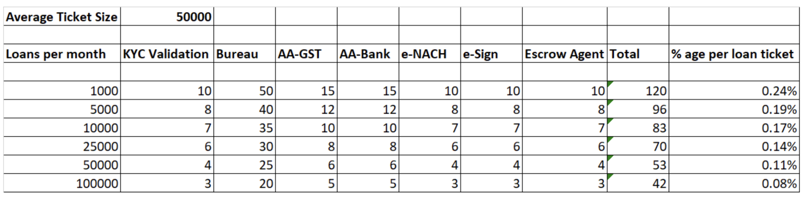
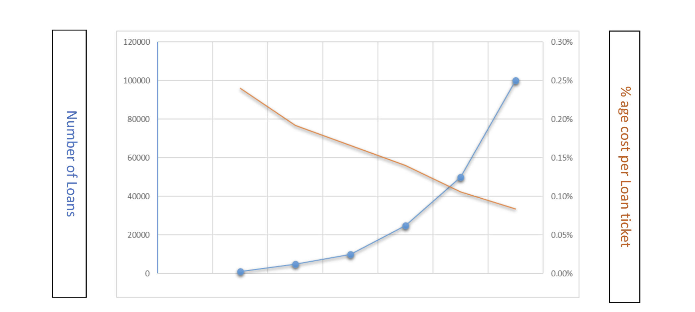

#### Highlights

* Cost per loan has been the primary deterrent for lenders to add short-term lending in their portfolios. 
* OCEN 4.0 offers a strong case for lenders with respect to small-ticket, short-tenure loans as they help minimize loan processing costs and provide easy access to new borrower segments at scale.

<!--truncate-->

# Short-term lending has traditionally required high processing costs
Historically lenders have been focused mostly on higher ticket and longer tenure loans. Loan processing has traditionally involved multiple manual checks, validations, verifications and manual operational processes which impacted the origination cost per loan, hence it made economic sense to lend higher ticket and long tenure loans to justify the portfolio profitability.

Small ticket and short tenure loans involve higher origination cost and hence lenders have not focused on aggressively building such portfolios Or if they have, they have charged much higher interest rates and fees to the end borrower to justify their portfolio profitability.

Typical credit needs for the nano-entrepreneurs are in the range of INR 5,000-1,00,000. In business, credit is most accessed for replenishing inventory, managing cash flow stuck in receivables, business expansion, machinery / equipment purchase, etc. Credit needs are poorly anticipated and often urgent, with capital being required within a day or two. The lack of options for formal sources of credit for this audience is because of the difficulties in underwriting such loans and the disproportionately high cost of operations anticipated, in order to service such small loan amounts. 

# 2x returns from short-term lending via OCEN 4.0
OCEN 4.0 tries to solve this problem for all the ecosystem participants including the Borrower agents, Lenders, Loan agents and primarily for the end-borrowers using the digital public infrastructure to minimize loan processing costs for small ticket short tenure loans at scale.
Consider the example below comparing a traditional long-tenure loan (36-months) versus a sachet loan (3-months). 

| | Traditional Business Loan | Sachet Loans (Small Ticket / Short Tenure) |
| --- | --- | --- |
| Loan Amount | 10,00,000 | 25,000 |
| Tenure (months) | 36 | 3 |
| Processing Cost per loan | 100 | 100 |
| %age of Loan ticket size | 0.01% | 0.40% |

Assuming the same processing cost for both loans, the unit economics at a loan level are unfavorable for small ticket short tenure loans as the per loan processing cost as a percentage of the ticket size is significantly higher. However, at scale, this issue is resolved. 

| | Traditional Business Loan | Sachet Loans (Small Ticket / Short Tenure) |
| --- | --- | --- |
| Loan Amount | 10,00,000 | 50,000 |
| Tenure (months) | 36 | 3|
| Net Interest Margin| 5%| 5% |
| Processing Fees| 2%| 1% |
| | | |
| Net Interest Income| 78,952| 417|
| Fee Income | 20,000| 500|
| Total Revenue per Loan | 98,952| 917|
| | | |
| Portfolio Size | 10,00,00,000| 10,00,00,000 |
| No of Loans| 100 | 2000 |
| Portfolio Revenue of Loans | 98,95,200 | 18,34,000|
| No of Loan cycles in 3 years | 1 | 12 |
| Net Total Revenue| 98,95,200 | 2,20,08,000|
*Above table does not assume redeployment of principal recovered from EMI’s before full loan maturity.

Citing the above example, a lender can earn as much as 2.2x higher revenue on a Portfolio exposure of 10 Cr with exposure to small ticket short tenure loans given to a much larger set of borrowers compared to big ticket long tenure loans given to a small number of borrowers.

However the question of higher operational cost per loan creates a hurdle to assume such returns on a small ticket loan portfolio.

Typical operational cost for processing a small ticket loan digitally could range between Rs.50-100 depending on the various participant services (TSP transaction cost, Underwriting modeler, AA-GST, AA-Bank, Bureau, KYC, e-NACH, e-Sign, disbursement partner, collection partner) involved as per the product group policy during approval process. The costs have come down over the last 3-5 years and will continue to reduce further as these services get more efficient and commoditized. This per transaction cost across various services tends to reduce as scale shows up.

*Above costs across services are notional and may vary across service providers.

Above trendline chart showcases that the decreasing per loan processing cost with an increasing scale ensures profitability at scale.

Even if we calculate the overall profitability for a small to mid sized portfolio of 2000-20000 loans it would still be more profitable than the big ticket loan portfolio at a return of 2.1-2.20x , even though we consider higher operational costs per loan.

It is interesting to note that at a larger scale, upwards of 1,00,000 + loans, the operational costs reduce significantly and produce much higher profitability. This is a large opportunity for lenders to build profitable loan books.

# Other favorable factors
Small ticket short tenure loans primarily provided for revenue generating business-end-use tend to perform much better in terms of timely repayment as the loan proceeds help the small business borrowers to increase their business.  Since the repayment of these loans gets over in a short tenure (up to 3 months) with amortizing principal recovery every month, the portfolio delinquency rates are expected to be lower. With timely repayment of these loans it increases the credibility of the borrowers to seek higher loan amounts and incentivizes a good repayment behavior.

Compared to large ticket loans, these are granular loans and avoid the ill effects of any large loans going bad affecting the portfolio performance due to bulky lending with risk concentration amongst a few sets of borrowers.

Small ticket loans have a better predictability due to short term repayment tenures and helps build credit profile for repeat lending to the emerging and new to credit MSME borrowers. If the credit underwriting is done properly particular to the industry requirements, it ensures better delinquency and higher profitability at a scale with a large potential to onboard a large number of new to credit, new to banking emerging segment borrowers and offer various financial products and services as they step up the ladder.

Finally, since the same loan amount gets reused over a large number of loan cycles, the lender can learn a lot more about their borrower base. They can perform better underwriting and also innovate on creating better products that meet the specific needs of the borrowers. These factors help create a positive feedback loop in the ecosystem that amplifies the benefits for all participants.