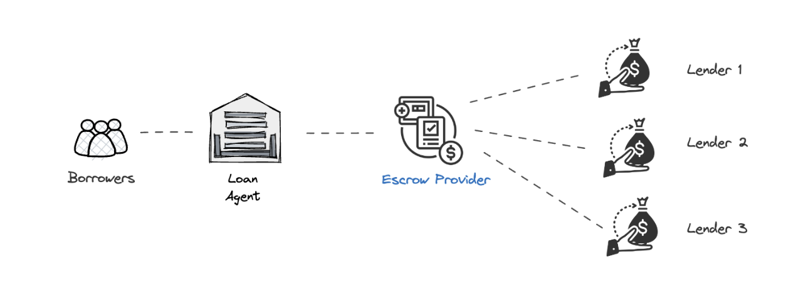

#### Highlights

* Loan collections are an essential element of the lender’s financial health and stability. 
* OCEN 4.0 introduces specialized roles, including collections partners, that can help reduce the burden on lenders. 
* Short-term lending products for marketplaces where Loan Agents also control the income-source for the borrower can use escrow-based-repayments to mitigate the collections risk.

<!--truncate-->

# Collections partners in OCEN 4.0

For a lender wanting to serve new short-tenure small-ticket products on OCEN 4.0, especially to a new segment of borrowers, loan collections are a valid concern. Timely and efficient collections not only ensure the stability of cash flow but also contribute to the overall growth and sustainability of their lending venture. Since different products and different borrower segments may require different types of collection methodologies, if a lender lacks the experience, understanding and the resources to perform effective collections, they may not be comfortable or successful in serving these products. 

As a mitigation, OCEN 4.0 introduces specialized roles in the lending flow apart from lenders and loan agents. These include KYC partners, derived data partners, disbursement partners and also collections partners. This reduces the burden on lenders enabling them to focus on core lending functions as they can optionally collaborate with other partners in the lending value-chain to serve the product. Specifically within the loan-repayment and/or the collections journey, multiple flows are possible in OCEN 4.0 including payment-link, eNACH, escrows etc. where the lender can collaborate with a collections partner to serve the product.

# Collections control products in OCEN 4.0

The philosophy with OCEN 4.0 is that of enabling “local partners with remote lenders”. Any service provider with a community of customers can now serve as a loan-agent to extend credit products to their customer (acting as borrowers) where the product is served by a network of participants - lenders, KYC / disbursement / collections partners etc. 

In many such scenarios, these loan-agents also serve as the income-source for the borrower. In such cases, escrow-based-repayment helps mitigate the collections risk for the lenders and provides them significant confidence in the collections efficiency of the network.

For example, in PO-based financing like GeM Sahay, a supplier (borrower) obtains a loan based on an approved Purchase Order (PO). When GeM makes the final payout after goods/services delivery, the funds don't directly reach the supplier's bank account. Instead, the funds are directed to an escrow account. A rule-engine within the escrow calculates the lender's due amount (if any) and facilitates payouts: one part to the lender and the remaining balance to the supplier.

# Escrow-based-repayments in OCEN 4.0

In the auction-based model of OCEN 4.0, the loan-agent works with the Escrow-as-a-Service provider (EAASP) rather than the EAASP working with individual lenders. This ensures that a single transparent rule-engine manages the split of funds for any borrower within the network. It also provides lenders with a collections-ready network to participate in.

EAASP here refers to the EAASP and a Trustee as a combined role. The trustee is a SEBI backed entity that can be entrusted to execute the instructions on behalf of the lender in the escrow. 

A typical escrow-based flow in the OCEN 4.0 network is shown below:

The loan-agent includes the EAASP/trustee as a participant in the product network to offer the credit product alongside lenders and other participants. When a potential borrower receives a loan, the EAASP provides a virtual account (VA) where the loan-agent deposits funds, rather than the borrower's bank account. These funds are then utilized for loan payouts.

Whenever a new Loan is disbursed, the loan-agent is notified of the disbursal by the lender and they in-turn update the EAASP to modify the escrow rule-engine for that borrower. EAASP then creates a new entry for the borrower if no outstanding payouts pending or updates an existing entry.

Whenever a credit is made into the VA by the loan-agent, EAASP checks for live loan repayments for the borrower and verifies with the lender on any due repayments. The EAASP rule-engine enables a multi-way split of funds across the lender, borrower, loan-agent and EAASP (fees if any) and the transactions are recorded by each party alongside necessary updates to the borrower’s loan balance. 

The effectiveness of collections control with escrow-based flow depends on multiple factors with various possible scenarios as shown below.

| | Scenario | Comments |
| --- | --- | --- |
| 1a | Loan repayment date after payout date | EAASP can hold the funds in escrow for the interim. |
| 1b | Loan repayment before payout date | Lenders will mark as delayed payment. Penalty and impact to borrowers’ score. |
| 1c | Loan repayment on the payout date | Ideal. Need to keep loan tenure flexible. Already live at GeM Sahay.|
| 2a | Multiple loans running and payout not enough to pay all lenders. Payout mapped to an invoice/PO | Payout done to the lender which had financed the PO/Invoice.|
| 2b | Multiple loans running and payout not enough to pay all lenders. Payout NOT mapped to an invoice/PO | Complex use cases where the logic used to split funds and which lender is prioritized needs to be pre-defined and followed. |

With the expansion of OCEN 4.0, encompassing diverse products across various participant networks, the prevalence of intricate collection scenarios using escrow-based repayments is set to rise substantially. This trend also presents an opportunity for specialized escrow-service providers to shape industry best practices and foster innovative approaches, ultimately shaping a top-tier, scalable collections experience. 

---

If you are an Escrow-startup or a payment aggregator (with Escrow solutions)  talk to the OCEN team to get started today. We would love to hear back from you.

