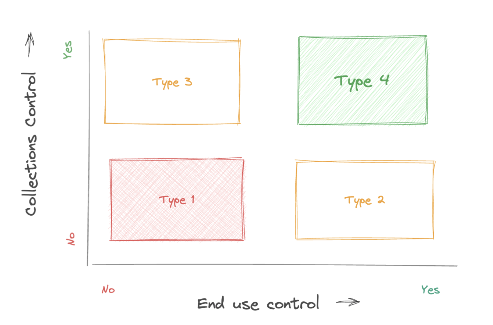

#### Highlights

* Loan products can be classified into 4 types of loans - T1, T2, T3 and T4, on dimensions of end-use control and collections control
* OCEN 4.0 product registry allows any credit product to be configured 
* OCEN 4.0 enables new data sets for underwriting and participant roles that help convert traditional T1 products to T2, T3, T4 products in OCEN

<!--truncate-->

# Framework for evaluating lending products 

It is easy to disburse loans, it is the collections which are critical and hard. Controlling NPAs (non-performing assets) to an acceptable level is critical for scaling unsecured lending portfolios.

There are two dimensions for building collections confidence in a lending product:
1. **End-use-control:** Products with end-use control enable the lender to have control over where the disbursed loan funds get deployed. This provides confidence to the lender that the funds are utilized for the activity for which the loan was approved.
2. **Collections control:** Products with collection control enable the lender to have control over the repayment of the loan directly from an income-source for the borrower. This provides lenders the assurance of repayment from an expected income for the borrower.

Based on the above two factors, one can build a classic 2 x 2 grid as below with 4 types of possible loan products. We refer to these as T1, T2, T3, and T4 type loan products - with the collections confidence increasing from a T1 product  to a T4 product.

**Type 1 Product: No end-use control + No collections-control**
In a type 1 loan product, the lender has no control over how the funds would be used. Eg: Would the borrower, say a dairy milk aggregator, buy cattle feed or a plasma TV? Moreover the lender has no control over the on-time repayment from the borrower even if the borrower had income coming in for the repayment. The lender will need to have a physical collections back-up should the eNACH or other auto-repayment mechanisms to get funds from the borrower’s bank account fail.

**Type 4 Product: End-use control + Collections-control**
On the other hand, in a type 4 loan, the lender is assured that the funds would be used for meaningful commerce. Eg: The loan is not disbursed to the bank account of the dairy farmer but instead goes directly to fund their checkout invoice (for fodder or cattle meds) on an agri-supply marketplace. Moreover if the loan agent has enrolled the private dairy (that pays out to the borrower) to participate via an escrow setup, the lender would be assured that the next payout to this borrower would lead to partial or full recovery of the expected loan repayments. 

**Type 2 and Type 3 Products:**
Consider the above Type-4 product with just collections-control (T3) or just end-use control (T2). In a T3 loan, while the end-use is not controlled, there is a high confidence in loan-repayments flowing through on a timely basis. In a T2 loan, while the end-use is controlled, the collections are still not promised. Hence lenders may prefer a T3 over T2, and T4 above all other types.

# Products in OCEN 4.0
The goal with OCEN 4.0 is to enable a cambrian explosion of possible products, each customized to meet the specific needs of different borrower segments.

OCEN 4.0 introduces the Product Registry as a new component which is a product configuration file for each new product imagined and launched using OCEN. It captures the details around the target borrower persona, the tenure of the loan, repayment frequency (bullet, periodic etc), additional data required, whether Account Aggregator framework is invoked or not, is there a disbursement control (end-use control) and if there is a strong collections support (e.g. escrow based collections).

OCEN 4.0 also enables specialized participant roles where a loan-agent (such as agri-supply marketplace) can enable end-use or or collections control for the lender by participating as a derived-data partner, collections partner, or disbursement partner to serve the product.

While all the 4 loan products mentioned are possible via OCEN, focusing on T4 is a win-win-win for all, especially as we solve the MSME credit gap via short tenure small ticket loans.

