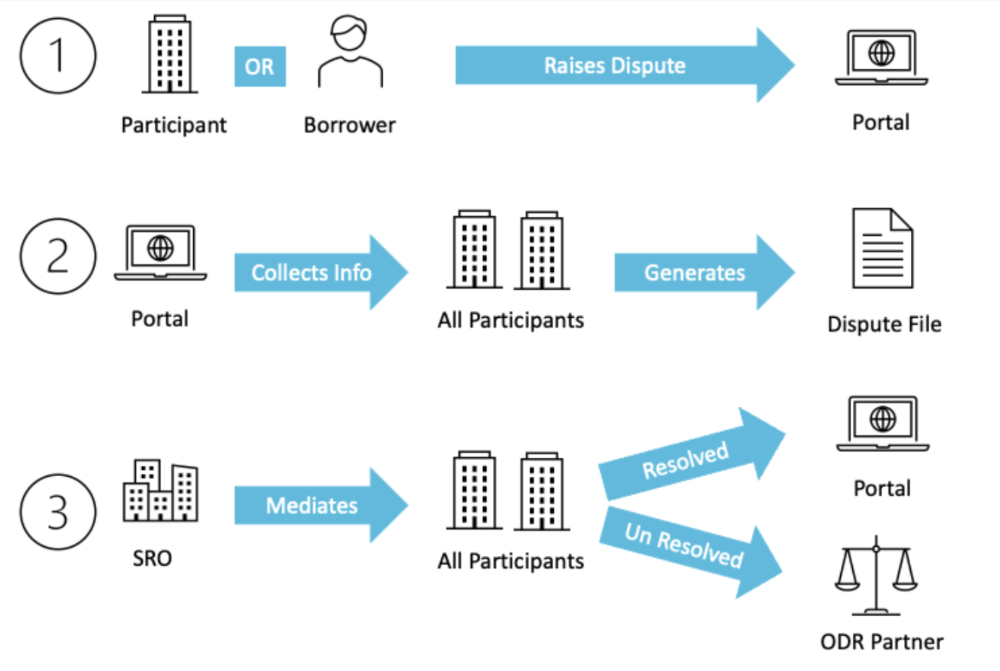

#### Highlights

* Robust dispute resolution mechanisms are essential to the stability of lending operations and to prevent disruptions in the ecosystem. 
* Delays in dispute resolution can undermine trust between parties and disruptions to cash flow may cause significant impacts to the business.
* OCEN 4.0 includes a dispute resolution process that optimizes for speed, effort minimization and consistency via standardized APIs, dispute file formats and SROs for mediation.

<!--truncate-->

# Reliable dispute resolution mechanism is a MUST 
The experience of the past Digital Payments Infrastructure (DPI), particularly within frameworks like UPI and AA, underscores the critical role that efficient dispute resolution plays in maintaining the trust, integrity and sustainability of the ecosystem. To unlock the full potential of any DPI for lending at scale, it is imperative to establish a consistent dispute resolution mechanism that spans across products and network participants such as borrowers, lenders, and loan-agents (LAs). 

Traditional lending environments have regulatory oversight, established procedures, physical presence as well as participants with sufficient experience and resources. Yet, dispute resolution mechanisms are regarded as slow and expensive.This is on account of several key challenges that need to be overcome:

1. **Complexity of contracts and transactions:** Lending transactions often involve intricate terms and conditions, making it challenging to accurately assess the nature of disputes.
2. **Diverse stakeholders and needs:** Lending ecosystems encompass various stakeholders, including lenders, borrowers, intermediaries, and partners, leading to a variety of perspectives and potential conflicts.
3. **Information asymmetry:** Parties have differing levels of access to information, leading to disparities in understanding and interpretation.
4. **Subjectivity:** Disputes often involve subjective matters, making it challenging to arrive at an objective resolution.
5. **Lack of standardization:** While regulator-defined frameworks for disputes exist, their policies, practices and steps still have variations making the customer experience highly inconsistent and lacking standardization across different lending platforms and products.
6. **Technological Limitations:** Players in the lending ecosystem may also lack technological infrastructure to support the dispute resolution processes.

# Dispute resolution mechanism in OCEN 4.0
In its design, OCEN 4.0 strategically focuses on three vital dimensions concerning dispute resolution:
1. **Timeliness:** Swift dispute resolution is prioritized, ensuring that conflicts are promptly addressed.
2. **Efficiency:** Participants experience minimized effort when initiating or engaging in dispute- resolutions.
3. **Consistency:** A clear and transparent process is established to maintain uniformity across networks. For lender or loan agent this is no longer a bilateral arrangement.

These objectives are realized through the integration of three key elements within the dispute resolution framework:
1. Standardized dispute resolution APIs,
2. An intuitive dispute portal with automated dispute reports,
3. Oversight, guidance and mediation by SRO entities.

**Dispute Resolution APIs:** OCEN 4.0 establishes a set of uniform dispute resolution APIs and file formats. These APIs not only facilitate automated data collection for established dispute categories but also offer flexibility to adapt to diverse and emerging dispute scenarios.

**Disputes Portal and Dispute Report:** OCEN 4.0 introduces a user-friendly disputes portal, enabling participants, including borrowers, to initiate disputes effortlessly. When a dispute is lodged, OCEN 4.0 efficiently gathers relevant details from involved parties and automatically compiles them into a standardized dispute file. Furthermore, the platform's analytics service meticulously records loan journey events through heartbeat and analytics APIs, seamlessly integrating them into the dispute file. This compilation serves as an unbiased, comprehensive log of the entire loan journey, ensuring transparency and accuracy and speed.

**Mediation by SROs:** Within OCEN 4.0, every network is overseen by a designated SRO entity, such as DLAI or CredAll. When participants join the network, they undergo a uniform onboarding procedure that includes verification by the SRO. This standardized process ensures that all new members garner a consistent level of trust across the network. Significantly, the SRO also takes on the pivotal role of a mediator during the dispute resolution process.

The steps in the dispute resolution process are captured below. 

OCEN 4.0 streamlines the dispute resolution process through automated file generation, standardized APIs, and uniform file formats. The system's event records further enhance reconciliation. This not only minimizes participant burdens but also bridges information gaps stemming from asymmetry or technical constraints. Moreover, the presence of SROs as mediators during disputes preserves process trust and allays confidentiality worries. Sensitive financial data shared in dispute resolution is exclusively managed by authorized SROs, ensuring utmost confidentiality.

