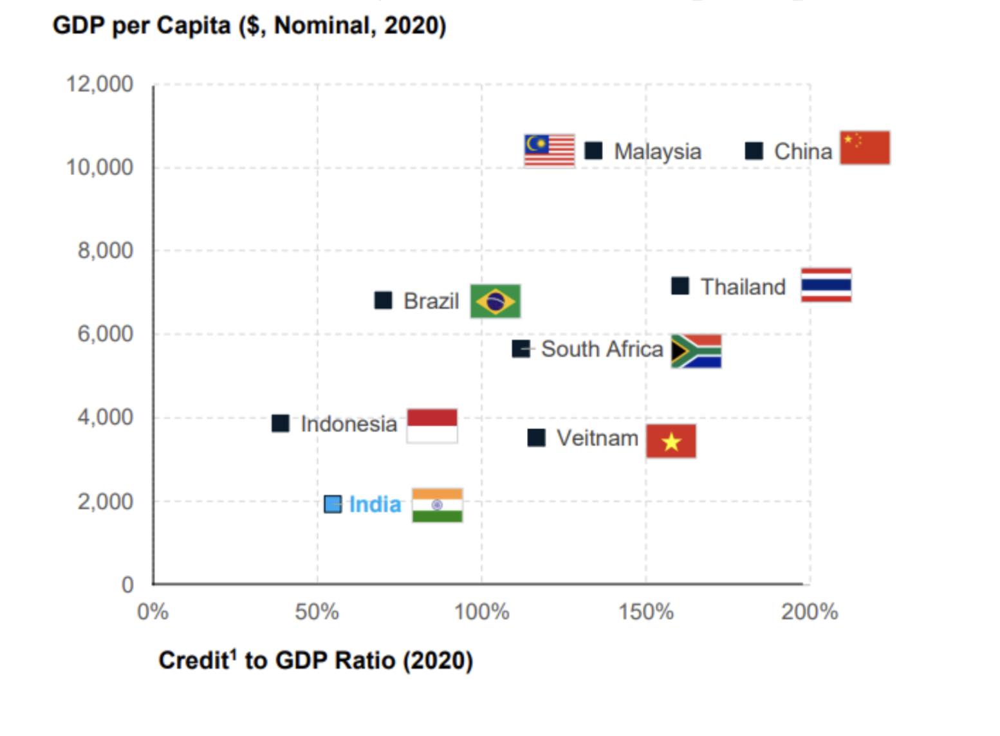

At a recent practice at my tennis club, my coach walked up to me and asked if my employer could help him avail a loan. He owns a piece of land just outside the city which could be used up as a tennis court. A loan would help him employ a few people to pave the land & build out the infrastructure for his own tennis club. “I have gone to multiple banks to help me get a loan but I have always been rejected for some reason or the other. They ask for too many documents. Would your company (an NBFC) be willing to help out with a loan?”. 

This is the story of countless people in India who are unable to access credit. Lack of documentation is just one of the countless reasons. India houses a total of 6.4 crore MSMEs (Micro, small and medium enterprises) with only ~16% of MSMEs having access to formal credit. The total MSME credit demand in India is considered to be $500bn out of which only $200bn is met by formal credit. The rest 60% demand is served by informal channels charging exorbitantly high interest rates; almost double to what the formal sector charges. The formal lending that is being done is also one-sided, currently ~4% of all MSMEs capture ~75% of the total credit lent out to MSMEs. These 4% include the likes of large manufacturers, distributors, upscale retail stores leaving out MSMEs like your neighbourhood kirana shop.

Compare this with the UK where the total SME funding gap is only 12% of the gap of India. Access to formal credit to MSMEs in China is as high as up to 55%. According to the World Bank, India’s credit to GDP ratio stood at 58% below the world average of 148% and lowest amongst its Asian peers- China (182%), South Korea (175%), and Vietnam (126%). A higher credit-to-GDP ratio indicates aggressive and active participation of the banking sector in the real economy while a lower number shows the need for more formal credit.

For emerging economies, credit is a key fuel to drive economic growth. Just like how VC funding is an indicator of the trust in high-risk businesses and a major source of funds for startups looking to massively scale; lending by banks/NBFCs is a crucial source of funds for the low to medium risk business segment.

The below graph from the World Bank maps the GDP per capita of the nation against its credit to GDP ratio. The graph shows a clear correlation - Higher the Credit to GDP ratio, better off the country in terms of GDP per capita. 

MSMEs employ approx. 11crore individuals in India. Reduced credit to MSMEs constraints their productivity growth which in turn, drags wages across the country. Increased credit allows firms to become more productive through either acquiring capital or hiring labour. This sets off a multiplier effect to help increase economic output in the form of GDP or exports. These productivity gains are also passed on to more to peripheral industries to set up a chain effect.

A case in point: Farming exports in the fiscal year ending March’23 was up by 9% from the previous 12 months, hitting $26bn and representing 7% of India’s outbound trade. This was despite the uncertainty in the agricultural sector surrounding the Russia-Ukraine war and the inefficiencies persistent in the agricultural sector. One leg of the triad (amongst technology, policy and finance) responsible for this flourish has been the increase in credit to the agricultural sector as a whole. Farmers who would receive loans with interest rates around 30% were able to get loans at one-third to half the interest rates with increase of agricultural lending by HDFC bank and other big private lenders. HDFC Bank increased agricultural lending from $1.2bn in 2015 to $7.5bn last year. Agricultural sector’s growth in GVA (Gross Value Added - a measure of economic activity on the producer/supplier side) today is a quarter more than that of manufacturing whereas a decade ago both the sectors saw similar growth rates. Better produce leads to farmers having enough capital to deploy the latest technology being built by whizzy “ag-tech” startups which further increase yields from farming, setting up a multiplier effect.

Lending not only helps the people looking for credit, but is also a major revenue channel for firms offering credit. By reducing the friction within the many linkages involved in lending, digital players who get involved with the ecosystem will receive a fillip in terms of additional revenues and monetization opportunities. With the recent FLDG guidelines by RBI allowing Default Loss Guarantee arrangements in digital lending, digital players (or loan agents - LAs) will have a bigger role to play in democratising lending. 

By enabling a plug and play model for embedded finance, OCEN will enable banks/NBFCs to harness the power of data sitting in siloes across India’s digital ecosystem to create new lending products. Digital payments have set the foundation by making the Indian consumer comfortable with the concept of ‘digital’ by reducing friction in each step of the payment process. With the foundation set by UPI & Account Aggregator, OCEN will ride the wave of increased digital literacy, trust and empowerment to unlock the value of data for greater economic growth of the country through easier and more equitable access to credit. And give hope to many more individuals who will be able to utilise credit for a brighter economic prospect, just like my tennis coach.

References:
1. [Mckinsey- FICCI Banking Committee Report: India’s Century Sustainable and Inclusive growth](https://india-century.com/reports/Exec-Summary.pdf)
2. [World Bank data – domestic credit to Private sector](https://data.worldbank.org/indicator/FS.AST.PRVT.GD.ZS)
3. [India’s journey from agricultural basket case to breadbasket](https://www.economist.com/finance-and-economics/2023/06/22/indias-journey-from-agricultural-basket-case-to-breadbasket)
4. [India's bank credit-to-GDP ratio inches up to 56% in 2020, but still way behind peers: BIS data](https://www.livemint.com/news/india/indias-bank-credit-to-gdp-ratio-inches-up-to-56-in-2020-but-still-way-behind-peers-bis-data-11624543454835.html)
5. [How India can fill the credit gap to fuel economic growth](https://www.ey.com/en_in/india-at-100/how-india-can-fill-the-credit-gap-to-fuel-economic-growth)
6. [Key facts on SME financing](https://www.oecd-ilibrary.org/sites/a3891ad8-en/index.html?itemId=/content/component/a3891ad8-en)
7. [SME funding gap report](https://info.codat.io/landing/smb-funding-gap-report)
8. [Recommendation of the UK Sinha Committee – 2018](https://www.rbi.org.in/Scripts/BS_PressReleaseDisplay.aspx?prid=47331)
9. [India economic data: Gross Value Added growth in manufacturing sector rises to 4.5%, 5.5% in agriculture](https://www.firstpost.com/india/india-economic-data-gross-value-added-growth-in-manufacturing-sector-rises-to-4-5-5-5-in-agriculture-12673832.html)
