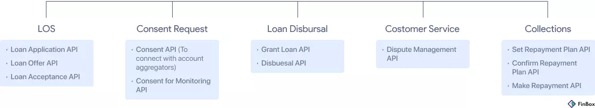

This is the summary of a very long blog post,

<!--truncate-->

The launch of the Open Credit Enablement Network, or OCEN, was the definitive step for India to move towards democratization of credit and financial inclusion. But OCEN isn’t a product or a service. It is a set of standards. It needs effective implementation to show results. Technology companies are building according to the standard and are adding the necessary functionality required to actualize OCEN’s vision. That’s where Embedded Finance comes in. Embedded Finance enables the implementation of OCEN in the real world.

What is the Open Credit Enablement Network? 

“India needs to go that extra mile in offering credit to the most deserving, smallest businesses and individuals. With most credit directed to large companies in large volumes, smaller companies and micro enterprises are left in the lurch with little or no access to credit at all which is a huge concern for the next growth phase of the industry”
- Nandan Nilekani, Global FinTech Festival, 2020

## OCEN represents the next stage in the evolution of IndiaStack

IndiaStack refers to a set of open APIs that allows governments, businesses, startups, and developers to utilize digital infrastructure. 

IndiaStack was launched in 2009 with the creation of UIDAI, and represented the first major disruption in India’s FinTech space. It offers open APIs as public infrastructure such as UPI, BharatPay, BBPS, Aadhar, AEPS, eKYC, eSign, DigiLocker, FASTag, and the GSTN platform.

IndiaStack APIs allow governments, businesses, startups, and developers to utilize digital infrastructure in order to facilitate presence-less, paperless, and cashless service delivery.

OCEN, launched as part of IndiaStack in July 2020, aims to change the way credit is distributed to the end-user by introducing new touchpoints for the distribution of financial services. It empowers new players (such as digital platforms) to play crucial roles in the lending value chain. It is a complete reimagination of the credit ecosystem in India. 

## What does OCEN mean for the lending ecosystem?

OCEN is a common language. A credit protocol infrastructure. It is a strictly defined spec of APIs that acts as a standardizing middle layer between lenders and digital platforms. 

OCEN contains an API for each step of the lending lifecycle. Digital platforms, which until now had a very high barrier to entry for offering financial services, can now seamlessly integrate these APIs as defined in the spec and integrate with multiple lenders, digitize the entire lending life cycle and offer credit on their platform. Similarly, lenders can now open their financial infrastructure to multiple digital platforms to source new pools of borrowers.

The different stakeholders in the OCEN ecosystem are:
1. Loan Service Provider (LSP)
2. Technology Service Provider (TSP)
3. Lender
4. Borrower

Loan Service Provider (LSP) - Any customer-facing digital platform that can source borrowers. A digital platform could be a web app or an android app that already has a core offering and a customer base. They can augment their product offering by originating and enabling credit on their platform itself. 

Technology Service Provider (TSP) - FinTech companies that work with both lenders and platforms to successfully onboard onto the OCEN protocol and use it to roll out tailored credit programs. Embedded Finance providers are a type of TSP.

Lender - Banks/NBFCs/small finance banks provide capital and access to core banking networks for the Embedded Finance Infrastructure company to build on.

Borrowers - MSMEs or individual consumers who will leverage credit options available within the LSP’s platform through a secure digital process. 

## Embedded Finance is the missing link between OCEN and financial inclusion 

“Many of the lenders are willing to adopt this protocol. Now we need marketplaces, or loan service providers to also adopt this protocol, which then allows them to embed loans in their daily working. For example, if you are a small company that provides tax uploading facilities to its customers, you can also provide credit to them. And you can embed the details using the protocol, and offer it to the lenders. The lenders will use their automated underwriting tools and give a loan. So you can actually go to a model where you can give short high-value loans in real-time with good underwriting and instant credit to the bank account of the borrower.”

- Nandan Nilekani, Global FinTech Festival, 2020

As mentioned, OCEN is a protocol. It is incumbent upon lenders and digital platforms to adopt these specs in the real world. That’s the gap between OCEN and financial inclusion in the real world.

Embedded Finance Providers fulfill that role. They provide the technology interfaces, modeling insights, and the advanced analytics that make innovative lending products a reality.

FinBox is one such Embedded Finance provider. Our solutions help develop a credit product configuration layer based on the customer demographics and data from the digital platform. As a result, they also boost conversions by enabling customized, in-context credit on the customer-facing platform.

Once the loan is disbursed, our CollectX product helps craft a tailored borrower communication and servicing strategy along with other stakeholders in the OCEN ecosystem.

In short, Embedded Finance companies help digital platforms and lenders come together and implement OCEN.

Here is what this implementation entails:
- Modifying the business processes and tech stack of digital lenders and digital platforms as per the OCEN protocol
- Developing a digital acquisition channel with end-to-end loan application journey
- Building FinTech partnerships with multiple lenders, platforms, credit enablement ecosystem (eNACH, PAN verification etc)
- Writing cash flow-based and alternative data-based underwriting models
- Developing analytics and business rules layer in collaboration with both parties
- Developing a borrower communication and servicing layer in collaboration with both parties
- Developing a payment reconciliation layer

Combining their financial know-how and tech expertise, Embedded Finance Providers leverage their unique position and digitize the lending lifecycle. They empower platforms to embed financial services within themselves and thereby unleash the real potential of OCEN.

The Impact of OCEN and Embedded Finance
Effective collaboration between lenders and LSPs can improve customer acquisition, underwriting, collections, monitoring, and overall ROI for all parties involved. This makes a self-enforcing flywheel.

“Just like UPI created a common language between debit and credit and so on, and allowed us to create this huge ecosystem, OCEN protocol also enables that. This is something that is going to have a big impact. For the first time, we can truly democratize credit, and make sure credit reaches all the small companies and street vendors and so on.”
- Nandan Nilekani, Global FinTech Festival, 2020

### Democratization of credit

Embedded Finance and OCEN democratize credit data and the ability to offer credit services. This encourages new players to play crucial roles in the delivery of credit. Digital platforms can now leverage their positions to distribute credit to their customers and technology players can make meaningful additions to the lending value chain to make it effective and inclusive.

### Financial Inclusion

According to the International Finance Corporation, the credit gap in India’s MSME market is estimated to be an astounding $400 billion. Credit flow to MSMEs in India has always been broken. The lack of formal data to underwrite MSMEs makes it expensive for financial institutions to identify creditworthy borrowers.

In addition, MSMEs have very specific credit needs. They need smaller loan amounts, shorter repayment timelines, and quick access to funds, on a repetitive basis. Since underwriting MSMEs is complex and expensive, banks can’t afford to do small ticket size loans, and usually take a long time to process their applications.

OCEN and Embedded Finance help evolve this system. The entities closest to borrowers can deliver financial services. They can bring valuable platform data for underwriting new-to-credit customers. By leveraging Embedded Finance, they can innovate and provide cheap and tailored credit solutions to MSMEs, leading to the growth of the MSME sector.

Embedded Finance is our best shot at driving financial inclusion. People across socio-economic layers of society will get access to cheaper and improved financial services.

### New Credit Products

OCEN facilitates easier and effective partnerships, resulting in digital platforms with a deep understanding of their customers being able to do what is known as specialized origination. They can provide in-context, tailored credit products with favorable terms by collaborating with lenders that work for all parties involved (especially borrowers).

In summary

Embedded Finance Infrastructure allows both the lender and LSP to play to their strengths - enabling increased customer and data access for the former, and improved customer acquisition for the latter. The end result? Seamless and tailored financial products for those who need it the most.

