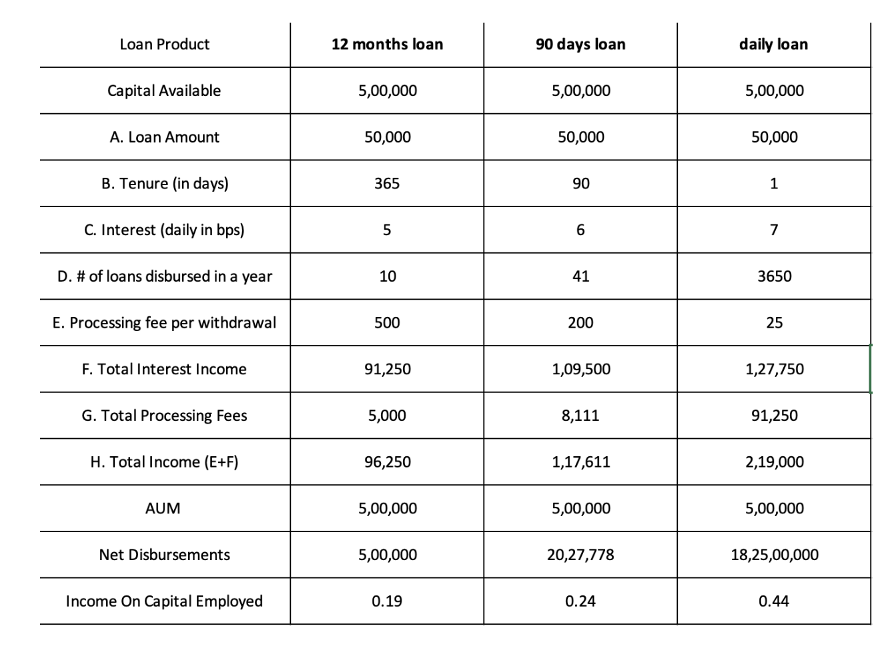

# Highlights

* AUM has traditionally held the spotlight as lenders' key metric, but AUM might not reflect the opportunity within short-term lending. 
* With AA and OCEN 4.0, short-tenure lending offers growth potential for MSME lenders - tap into significant drop in operational and sourcing costs, while offering a significant scale. 
* Need to look beyond AUM to truly value short-term loan pools.

<!--truncate-->

Short-term MSME lending - a significant growth opportunity

The [RBI UK Sinha MSME Report](https://www.rbi.org.in/Scripts/BS_PressReleaseDisplay.aspx?prid=47331) reveals that only 11% of MSMEs have access to formal credit channels, and an astonishing 60% of credit demand remains unmet. The most significant gap exists for small, short-term loans for MSMEs across various sectors. For example, in the business correspondent ecosystem, the retailers need balance in their eValue with the service provider. They would need a 1-day loan to top-up their balance when their balance runs low, which can be repaid the next day post cash-collection. Similarly, in the dairy value chain, village level entrepreneurs (VLE) aggregate milk for private dairies where their payouts happen once in 10 or 15 days. They need sachet loans for the 1-2 week period. 

While short term MSME lending has long been neglected by traditional lenders, more and more lenders have shifted their attention to the untapped opportunity in this space. NBFCs have short-term loans as a growing contribution in their portfolio with a lot more Fintechs serving as Loan agents. Innovation in the India stack, such as availability of GST data on Account Aggregator and upcoming OCEN 4.0 continue to unlock more growth opportunities for banks and NBFCs. Lenders now have easy access to a large volume of credit-starved MSME borrowers, with significantly low operational costs of serving small ticket size loans. For example, the entire loan application processing in GeM SAHAY including the amount disbursement is completed in 7 minutes. 

Metrics to account for the short-term lending opportunity

When the unit economics of sourcing & onboarding a new loan was high, keeping the tenure long made sense. Hence focus on AUM was meaningful. But this may not hold true in short-tenure lending markets. As a snapshot metric, AUM does not showcase the business done over a period of time. As lenders shift their focus on short-term lending, they need better business metrics, beyond AUM (Assets under management), to accurately capture and measure the opportunity. 

Imagine a lender doing the 1 day loans borrowers in a business correspondent ecosystem. In their case the loan-book is built and vanishes every day. The AUM will be near constant and without much of an increase. However it will not reflect the fees or the interest income earned by the lender from deploying the capital over and over again. 

Additionally, the lender would have learnt a lot (and very fast) about their borrower base from the repayment history of these short loans, which in turn would enable them to perform better underwriting and focus on product innovation. These too will not be sufficiently captured via snapshot metrics such as AUM. 

Let us consider 3 different loan portfolio options as depicted in the table below. 

loan_portfolio

We have assumed that short tenure loans allow for higher loan pricing with a processing fee per loan disbursal, as is already the case in the market. We have also assumed a reasonable loan-demand to keep the capital fully deployed across the three options for the full year. And we have added a very small cost for a new loan account for an existing borrower so that it does not eat into the processing fee component of income in short tenure loans.  (oversimplified assumptions made to illustrate the point)

The illustration showcases the growth opportunity for the lender with more than double IOCE for the daily loan versus the 12-month long tenure loan. The AUM however is constant across all 3 portfolio options.

Lenders already incorporate multiple other business metrics in their annual reports. These  include:
1. **Scale metrics**: Net disbursements and Net Total Income 
2. **Efficiency metrics**: Cost to income ratio, Return on Capital Employed (ROCE) and Return on Assets (ROA)

As short-term lending becomes a larger part of their portfolios, lenders will need to reevaluate their business metrics to accurately capture the short-term lending contributions in their portfolio. 

We also expect that such metrics as well as new metrics would bubble up across multiple realms such as for co-lending partners or wholesale capital providers to evaluate individual loan-pools and their originating partner(s), or for investors to evaluate lending ventures for making new investments as well as for measuring the performance of their existing portfolio companies. 

