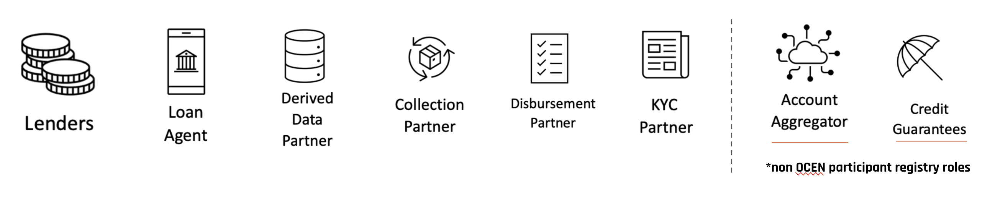

# Participant Roles

OCEN 4.0 supports specialized roles for the participants. The purpose of introducing new roles is that it promote specialization and enhances system efficiency. For example, by establishing a local network of participants, the burden on lenders is reduced, resulting in increased credit accessibility in underprivileged areas.

| Role                      | Description                                                                                                                                                                                                                                                                                                                                                                                                                                                                                                                                                                                                                                     |
| -------------------------------- | ----------------------------------------------------------------------------------------------------------------------------------------------------------------------------------------------------------------------------------------------------------------------------------------------------------------------------------------------------------------------------------------------------------------------------------------------------------------------------------------------------------------------------------------------------------------------------------------------------------------------------------------------- |
| Lender                  | Lenders are the regulated entity that create and own the credit products. They work with other participants as part of a Product Network to serve the Borrower. The Loan-agent understands the borrowers' credit requirements and works with the lenders to create the product.                                                                                                                                                                                                                                                                                                                                                                                           |
| Loan-Agent (LA)                  | Agent of the borrower who will help the Borrower to pick up the best loan offer. The Borrowers agent will charge the Borrower a fee for helping them select the best loan. Loan agent is a more inclusive term that encompasses both Borrower Agent (BA) and Lender Service Provider (LSP), spanning across the existing DLG model referred to as LSP and the emerging model in which BA operates as the borrower agent.                                                                                                                                                                                                                                                                                                                                                                                           |
| Derived Data Partner (DDP)       | A derived data provider is a collaborating partner within the network that furnishes supplementary data to the Lender, aiding in enhancing their underwriting engine with additional information.                                                                                                                                                                                                                                                                                                                                                                                                                                               |
| Collections Partner (CP)         | A Collections Partner is a network-affiliated collaborator designated by the Loan Agent (LA) to aid in the collection process. The lender retains the option to either opt for the Collections Partner or continue using their existing collection procedures.                                                                                                                                                                                                                                                                                                                                                                                  |
| Disbursement Partner (DP)        | A Disbursement Partner (DP) is responsible for supporting Purpose Controlled products. This partner will establish integration with suppliers, retrieve their catalog, and facilitate seamless direct payments to suppliers within the OCEN journey.                                                                                                                                                                                                                                                                                                                                                                                            |
| KYC Partner                      | A KYC partner is a collaborator selected by the Loan Agent (LA). This partner can be engaged for Assisted KYC or any technology-related specialization available on the network. The lender retains the choice to employ the KYC partner within the network or continue with their existing procedures.                                                                                                                                                                                                                                                                                                                                         |

In addition to the participant roles above, OCEN framework also relies on Account Aggregator and Credit Guarantees (CGTMSE) as part of the loan journey.