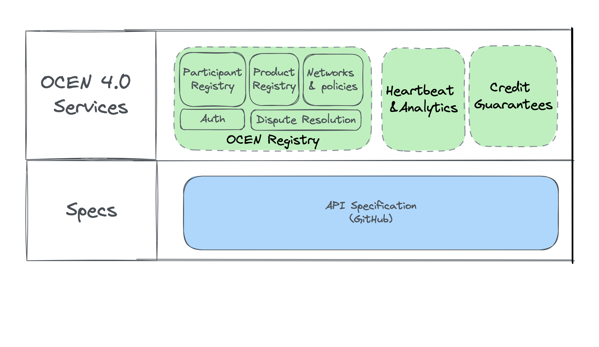

# OCEN Components

The components of OCEN 4.0 are captured below. These include:

1. **OCEN Registry:** OCEN Registry helps manage
    * **Participants:** Manages all participants on OCEN
    * **Products:** Manages all products on OCEN
    * **Product Network & Network Policies:** Manages the serving of the product via a network of participants via defined network policies
    * **Authentication:** Enables security on the platform by providing client credentials

2. **Heartbeat and Analytics service** This service enables intrumentation across the loan journey and the requests for performance monitoring on the network and to drive business analytics.

3. **Credit Gurantees service:** Verifies eligibility of a borrower for a credit gurantee.

3. **OCEN 4.0 APIs** API specification for the participants to communicate with each other and the OCEN components.

