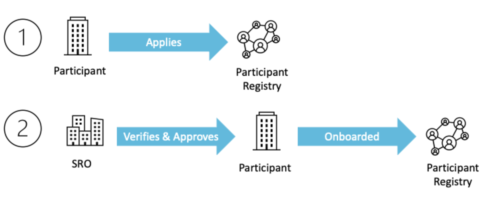
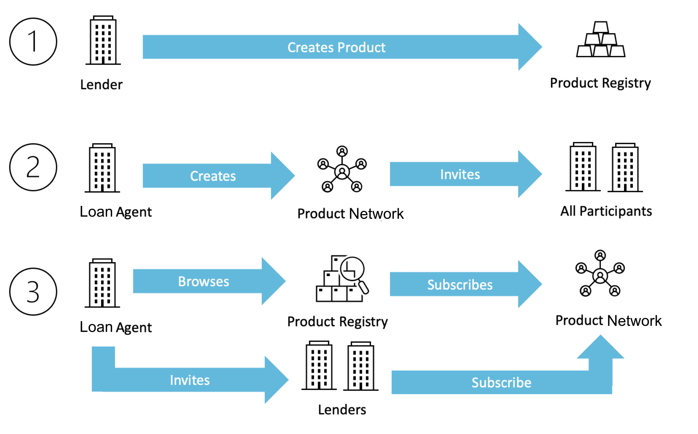

# Registries and Product Network

OCEN 4.0 introduces two separate registries - **Participant Registry** for Participants, and **Product Registry** for Products, that are maintained via SROs. All participants that serve a product do so as part of a **Product Network**.

These registries and the product network are part of the initial onboarding process onto OCEN 4.0.

# Participant Onboarding

All participants are onboarded to OCEN 4.0 via the participant registry. A standard onboarding process is followed for all participants, and their verification is guaranteed by SROs to ensure that new members receive an equivalent level of trust within the network.

# Product and Product Network onboarding

Lender will create & manage the Product and the Loan Agent will create & manage the Product Network to serve that product. All participants in OCEN 4.0 can browse the Products and Product Networks on the Product Registry and subscribe to serve a Product via the Product Networks.

# Registry access

The OCEN registries will be accessed via a **UI portal**. The portal will enable registration, management and discoverability of products, participants and product networks.

The OCEN 4.0 specification include APIs to programatically fetch the details of a product or a participant. These APIs can be used by the participants as part of the Loan Journey.

