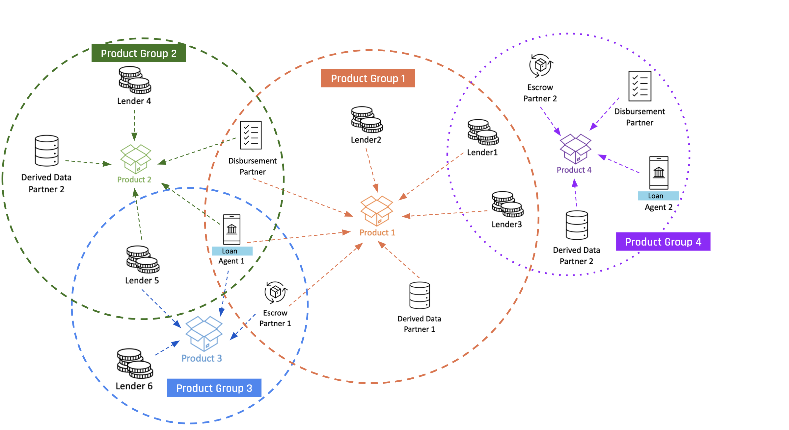

# Product Networks

OCEN 4.0 enables a network of product networks via with participants can discover, collaborate and serve products to borrowers. See sample example below:

1. Network begins with *Product Network 1*
    - Created by *Loan Agent 1* who onboards as network participants - 3 lenders, disbursement partner, collections partner and a derived data partner
    - Loan agent 1 can serve their borrowers other products as well. 

2. Network expands with *Product Network 2*
    - Created by *Loan Agent 1* who onboards as network participants - 2 new lenders, the same disbursement partner, and a new derived data partner
    - Loan agent 1 can continue to serve their borrowers other products as well. 

3. Network expands with *Product Network 3*
    - Created by *Loan Agent 1* who onboards existing participants and a new lender (Lender 6) to serve the product
    - Participants can discover products and join the product network

4. Network expands with *Product Network 4*
    - Created by a new LA, *Loan Agent 2*, who onboards existing and new participants to serve the product to their borrowers

