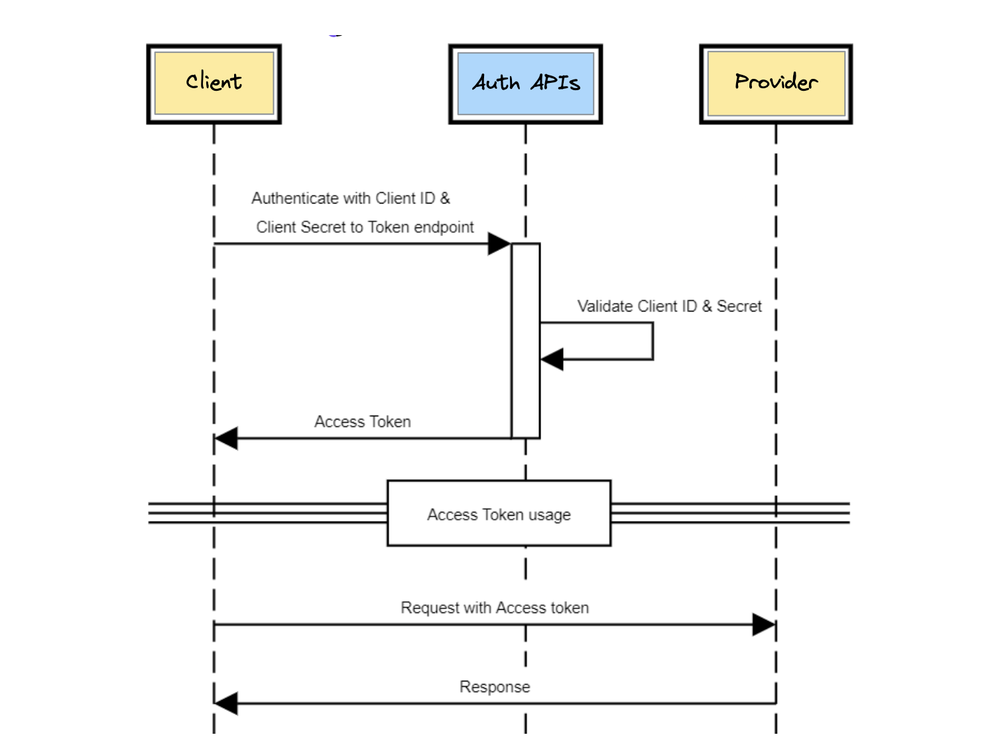

# Overview

The Auth service performs two key elements of security on the platform:

1. **Identity Verification:** 
    * Ensure that all entities are properly identified. 
    * Auth service uses OAuth 2.0 and OpenID Connect protocols for the same.

2. **Integrity and Non-Repudiation:**
    * Ensure authenticity & completeness of data exchanged between entities
    * This is achieved through digital signatures

All participants must register with Auth Service as client, as well as on Participant Registry with their API endpoints & public key. Each participant in the ecosystem may play the role of either being both or being one of an API provider and an API client to communicate with other modules. 

## Sample flow

Consider a sample API request in the platform from an API client to an API Provider.

1. API Clients need an [access token](./3-access_token.md) to present to the API providers, for them to authorize the calls.
2. API providers need access to the public key of token issuing Auth Service, to validate the access token presented by an API client.
3. API providers, upon identifying the API caller using the access token, further need access to the public key of the API caller available at the Participant Registry to verify the integrity of digitally signed request sent by API client.
4. On similar lines to (3), API Clients, while receiving response to their requests, also need access to the API Provider’s public key to verify the digitally signed response from the API provider.

## Onboarding

1. Reach out to Participant Registry administrators using an established channel (email, slack etc.) to get on boarded onto the OCEN ecosystem with following required details:
   - Participant Type
   - API Endpoint
   - Public Certificate Key
2. **Client Id & Secret** are issued as final output of this process using the Authentication Service.
3. Participant Registry is updated with participants details (API endpoint, Public key).

## Offboarding

1. Using an established channel (email, slack etc.) notify Participant Registry administrators to trigger the offboarding process.
2. Client Id & Secret are deactivated and removed from the authentication service.
3. Module API endpoint & public key entries are removed from Participant Registry.
4. All resource mappings are removed.

