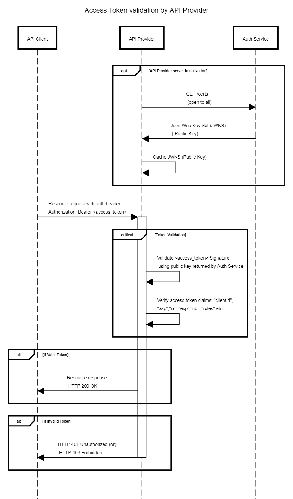

# Access Token

The Auth Service provides the dynamic and short-lived access token to each API client in the ecosystem. These access tokens are formatted as [JSON Web Token](https://datatracker.ietf.org/doc/html/rfc7519) (JWT). Each JWT is digitally signed by the Auth Service, as the issuer of the token. The digitally-signed access token is inserted into API authorization headers by the API client, as its identity token, for every call made to any API provider in the ecosystem.

JWTs are issued with a lifespan of 24 hours. So, all ecosystem API clients are expected to refresh their tokens every 24 hours.

JWTs may also contain roles and resource access details. These JWT claims (roles, resource access) can be used to implement fine-grained authorization at various levels in the ecosystem. 

## Access Token Structure

A JWT based access token consists of three concatenated Base64url-encoded strings, separated by dots (**.**):

> Format: {header}.{payload}.{signature}

1. **Header**: contains metadata about the type of token and the cryptographic algorithms used to secure its contents.
2. **JWS Payload** (set of claims): contains verifiable security statements, such as the identity of the user and the permissions they are allowed. Refer to the [payload schema below](#access-token-payload-schema).
3. **JWS signature**: used to validate that the token is trustworthy and has not been tampered with. When you use a JWT, you must check its signature before storing and using it.

## Access Token Payload Schema

Claim | Description | Mandatory | Format
----- | ----------- | --------- | ------ 
exp | Time after which the JWT expires | Yes | Long
iat | Issued at time — Time at which the JWT was issued; can be used to determine age of the JWT | Yes | Long
iss | Issuer of the JWT i.e. Auth Service URL | Yes | String
sub | Subject of the JWT (the API client) | Yes | String
jti | JWT ID — Unique identifier; can be used to prevent the JWT from being replayed (allows a token to be used only once) | No | UUID
nbf | Not before time — Time before which the JWT must not be accepted for processing | No | Long
typ | Type parameter is used to declare structural information about the JWT, e.g. ‘Bearer’ | No | String
azp | Authorized party - the party to which the Token was issued | No | String
scope | Scope values, e.g. openid | No | String

## Verify Access Token

On receiving the API call, the API provider will perform the following checks:

1. Decode token provided in Authorization header (it’s a base-64 encoded JWT token).
2. Verify token issuer authenticity – i.e. verify if token was generated by Auth Service
    - Retrieve Auth Service’s public key.
    - Verify token signature using public key.
3. Verify token validity:
    - Check token has not expired: `TokenClaims.exp > TokenClaims.iat AND IsInFuture(TokenClaims.exp)`
4. Verify other token claims, such as:
    - `TokenClaims.azp` - validate whether authorized party is actually eligible to make the request

### Sequence diagram:

