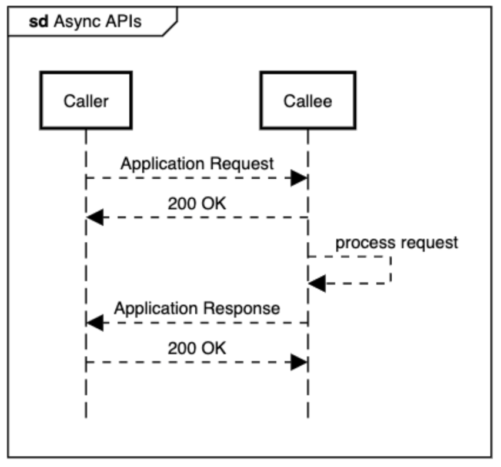

# API Design Principles

OCEN 4.0 specification adheres to the following key design principles.

## Async design

By design, all APIs are designed to enable end-to-end flows asynchronously. This ensures that the caller will not be unnecessarily blocked on a synchronous request and allows the callee sufficient time for processing and responding to the request.

All requests use the requestId field for the purposes for mapping responses to their respective requests. And each request generates a standard acknowledgement from the other end while the callee (typically Lender) processes the request. API callers (typically LA) can poll for the status of the operation using a webhook. Thus each operation will have two separate APIs - one from the caller to submit the request and another async response back from the callee when the operation has completed.

For example: Create Loan Application operation has the following 2 APIs:
- CreateLoanApplicationRequest -> Request sent by LA to the Lender
- CreateLoanApplicationResponse -> Async Response sent by Lender to LA

## Idempotency

By design, the API operations are expected to be idempotent. This allows for better robustness in the design by accommodating network errors, processing errors, etc with the participants.

All request calls should be idempotent on the requestId field i.e. two calls to CreateLoanApplication with the same requestId shouldn’t result in two applications to be created. Callees are expected to return the same response as sent earlier for a duplicate request.

## Security

*Identity verification*, *data integrity* and *request non-repudiation* are incorporated in the design as part of the security considerations of the framework. For identity verification, we ensure that all entities are properly identified and use OAuth 2.0 and OpenID Connect protocols for the same. Similarly data integrity and request non-repudiation is achieved through digital signatures to ensure authenticity & completeness of data exchanged between entities.

All participants must follow the security requirements while transmitting data over API calls. On a high level, these are the security aspects that need to be ensured.

* HTTPS - All API calls must be done securely over HTTPS
* Two-way TLS - The system should use Two-way TLS to ensure that both parties can send the information securely
* Digital Signature - All communication between the participants should be digitally signed as per the JSON Web Signature Specification
