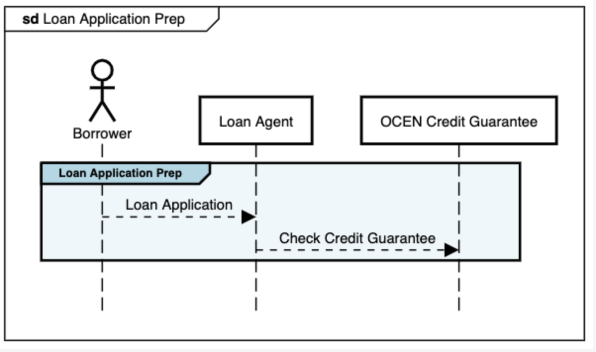

# Stage: Loan Application Prep

Once the borrower initiates a request for a loan appliaction, the loan application prepration involves the Loan agent checking if the customer is eligible for Credit Guarantee using the Credit Guarantee APIs. The result of the API call is added to the Loan Application.

