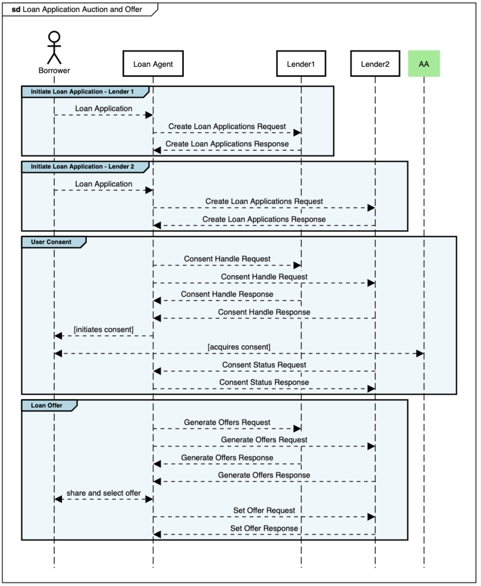

# Stage: Loan Application Auction and Offer

In this *"one-to-many"* stage, the LA shares the loan application with all lenders in the product network. The LA coordinates the request-responses across all lenders and enables the borrower to choose an offer from among all returned offers. There are 3 sub-stages to this process.

## Create Loan Application APIs
Loan agent forwards the Loan Application from the borrower to all lenders in the product network.

## Consent APIs
Loan agent receives the consent requests from Lenders and receives a single AA consent from the borrower which is forwarded back to the Lenders.

## Offers APIs
Lenders underwrite the loan application and generate offers for the borrower. Once a specific offer is accepted, the communication from the Loan agent switches from many Lenders to one Lender.

