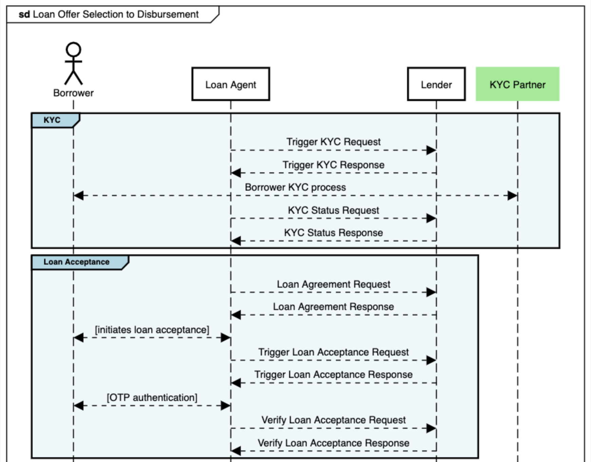
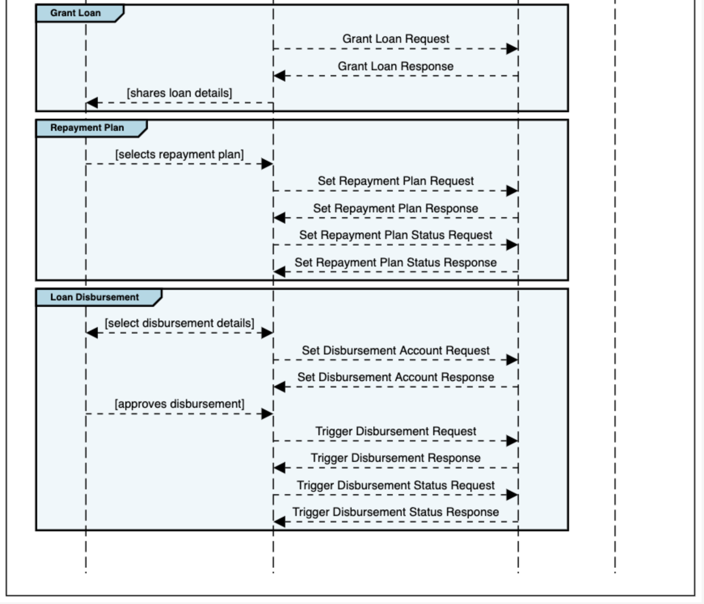

# Stage: Loan Offer Selection to Disbursement

This is *"one-to-one"* stage, where the LA helps with the processing of the loan application with the lenders whose offer was chosen by the borrower. The stage ends with disbursement of funds to the borrower account, or in case of purpose-controlled product, directly to the account of the other party. There are 5 sub-stages in this process.

## KYC APIs
Complete KYC process of the borrower after successfully accepting the final offer.

## Loan Acceptance APIs
Enables the borrower to receive the Loan agreement and accept the terms via OTP.

## Grant Loan APIs
Informs the borrower about the status of the loan in the lender system.

## Set Repayment APIs
Finalizes the details of the repayment plan that will be used by the borrower.

## Disbursement APIs
Sets the disbursement account that the borrower has chosen and trigger the disbursement of the loan.

