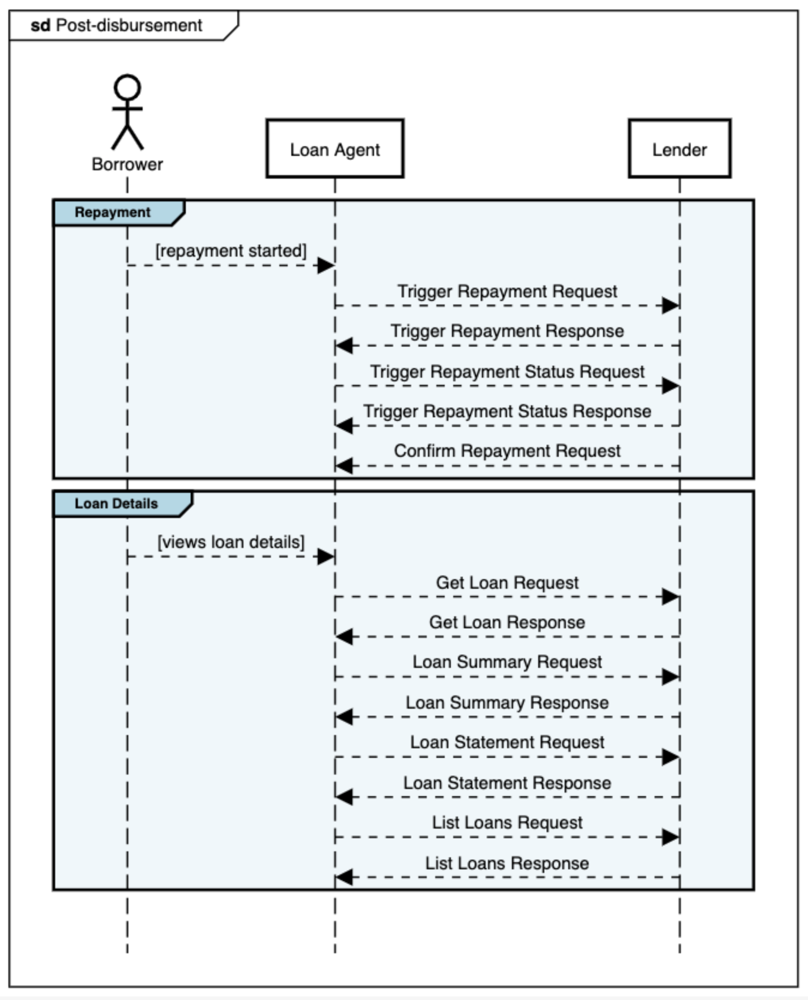

# Stage: Post-disbursement

These APIs are part of the loan journey but not part the sequence of the application processing steps. These APIs can be called by the participants at different times for a loan application after the loan amount has been disbursed. There are 2 sub-stages:

## Trigger repayment APIs
Informs Lender of a repayment. This API will not be called when payment is routed to lender via collection agent.

## Loan Details APIs
Loan agent uses these APIs to fetch the loan status, loan details, statements and loan summary from the Lender.

