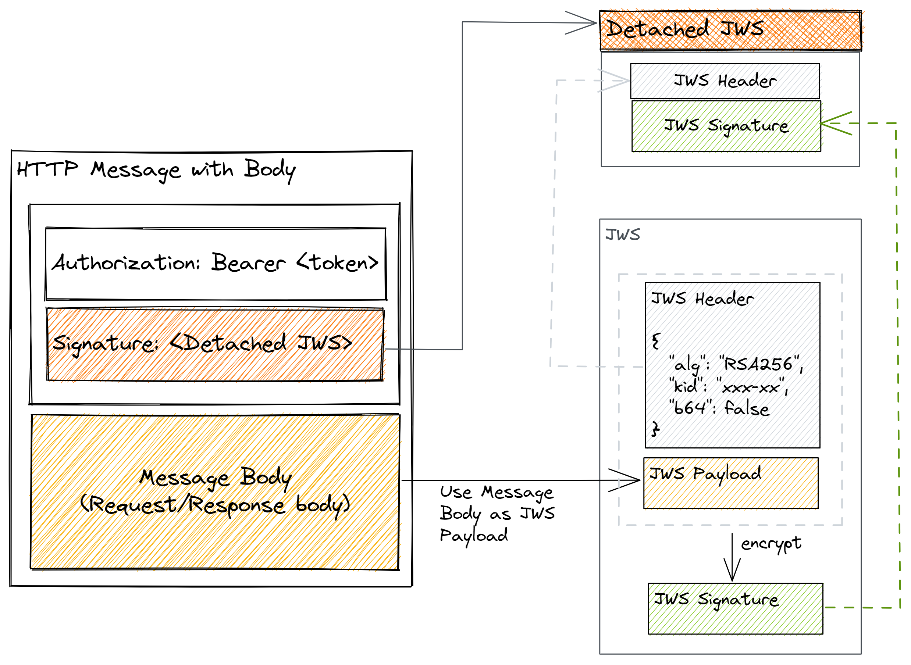

# Message Signing

While the authentication mechanism of associating an incoming request with a set of identifying credentials 
is provided by the [Auth Service](./readme.md). To provide the integrity and **non-repudiation**, whereby both parties (i.e., API Consumer & Provider) can assure themselves that the request and responses have originated by the private key holder and no message tampering has occurred somewhere in the connection, all requests must be digitally signed by the API consumer and all responses likewise must be signed by the API provider.

> SSL/mTLS (mutual TLS) provides an additional layer of security for data in transit. Such layered security approach ensures that each defense component has a backup to counter any flaws or gaps in the security.

> Non-repudiation: The participating entities in the OCEN ecosystem cannot deny their actions after performing the operations.

## JSON Web Signature

JSON Web Signatures (JWS) will be used to communicate the signature as part of the HTTP request/responses. These are standardised as part of [RFC 7515](https://tools.ietf.org/html/rfc7515).

A JSON Web Signature is a simple format:

```sh
base64Encode(header) + "." + base64Encode(payload) + "." + base64Encode(signature)
```

- The **header** contains parameters holding meta data about the signature (algorith for signing, the id of the key pair used etc.).
- The **payload** contains the actual content to be signed.
  > The payload will be the HTTP message body or endpoint URI (in case of HTTP GET requests).
- The **signature** is the cipher text from enciphering the <u>header</u> and <u>payload</u> together.

Using the HTTP message body as the payload is great for message signing purposes, however it leads to an almost doubling of the HTTP message size due to duplicating the HTTP body into a HTTP header. To overcome this, OCEN ecosystem will employ [Detached JWS](#detached-jws), as described in [Appendix F of RFC 7515](https://tools.ietf.org/html/rfc7515#appendix-F).

### Detached JWS

In the 'Detached Content' signature method, the generated JWS does not contain the content/payload part. Only the header and signature are returned. 

> A detached JWS is simply one where the payload is removed and provided elsewhere (for OCEN purposes the payload is provided in the HTTP body).

Other advantages of detached signatures are:
- request/responses that provide a malformed signature header can be rejected before ever reading the full HTTP body.
- isolation between message signing and business logic, from implementation perspective (as the HTTP body needs no manipulation).

As show in following diagram, **Detached JWS** is supplied in the HTTP header **Signature**.



