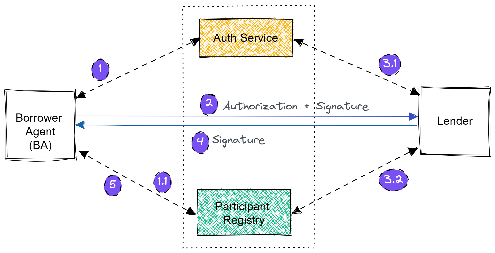

# Security
All participants must follow the security requirements while transmitting data over API calls. On a high level, these are the security aspects that need to be ensured.

1. HTTPS - All API calls must be done securely over HTTPS
2. Two-way TLS -  The system should use Two-way TLS to ensure that both parties can send the information securely
3. Digital Signature - All communication between the participants should be digitally signed as per the JSON Web Signature Specification
4. Post participant registration with the Participant Registry, the private / public keys for authentication will be available in the portal

## What is two-way TLS/SSL

The credit system that we are building is an asynchronous system and we need to ensure that both systems follow Transport Layer Security (TLS) Protocol to communicate with each other. In Normal TLS, the client first checks the authenticity of the server. However, the server does not try to identify the client. Since, in our case, we need to verify the identities of both the systems involved, “Two Way SSL” needs to be used. "Two-Way SSL" is usually called TLS/SSL with client certificate authentication because both parties authenticate each other.

## Making secure API Calls

Every OCEN participant may be an API provider or an API client. In these roles:

1. API Clients need an access token to present to the API providers to authorize the calls.
2. API providers need access to the public key of token issuing OCEN Auth Service to validate the access token presented by an API client.
3. Upon identifying the API caller using the access token, API providers need access to the public key of the API caller available at the Gateway to verify the integrity of the digitally signed request sent by the API client.
4. Along similar lines to (3), API Clients, while receiving the response to their requests, also need access to the API Provider’s public key to verify the digitally signed response from the API provider.

Following is a sample interaction between a Lender and a Loan Agent(LA), following the security guidelines mentioned here:

1. Loan Agent(LA) obtains an access token from Auth Service
    1. Uses the access token to fetch endpoint location of the lender(s).
2. Loan Agent(LA) call lender(s), attaches the access token to `Authorization` header & attaches body `Signature` header as well.
3. Lender, fetches two keys, to validate incoming requests: 
    1. Public key of the Auth service to verify the Authorization header
    2. Public key of the Loan Agent(LA), registered on the Gateway, to verify the Signature header.
4. Respond back to Loan Agent(LA), with response body `Signature` header attached.
5. Loan Agent(LA), fetches public key of the lender from gateway & processes the request if valid.