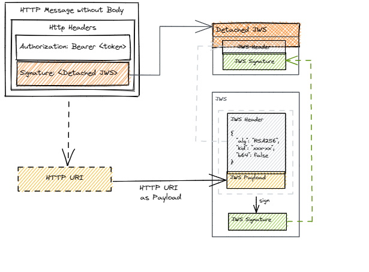

# Auth Service Overview

The Auth service addresses two main concerns in the ecosystem:
1. Identity of the entity accessing an endpoint
2. Integrity and non-repudiation so entities cannot deny their actions after performing any operation

The Auth service enables both concerns by providing API access keys for authentication of every request as well as signing every request/response with the security certificates.

## Overview

OCEN Auth Service is a standards-compliant OAuth 2.0 authorization server, as well as, a OpenID Connect protocol implementation.

OpenID Connect extends OAuth 2.0. The OAuth 2.0 protocol provides API security via scoped access tokens.

Following sections provide detailed information about the endpoints that the Auth Service exposes.

| Endpoint Name | URI | Use |
| ------------- | --- | ----------- |
| Token Endpoint | `/token` | Obtain an access and/or ID token by presenting an authorization grant or refresh token. |
| Json Web Key Set Endpoint | `/certs` | Get public keys / certificates used to sign Auth Service responses (including tokens).
| OpenID Connect Well Known Configuration Endpoint | `/.well-known/openid-configuration` | Get OpenID Connect metadata related to the authorization server.

### Digital Signature

### Detached JWS

In the 'Detached Content' signature method, the generated JWS does not contain the content/payload part. Only the header and signature are returned. 

> A detached JWS is simply one where the payload is removed and provided elsewhere (for OCEN purposes the payload is provided in the HTTP body).

Other advantages of detached signatures are:
- request/responses that provide a malformed signature header can be rejected before ever reading the full HTTP body.
- isolation between message signing and business logic, from implementation perspective (as the HTTP body needs no manipulation).

As shown in following diagram, **Detached JWS** is supplied in the HTTP header **Signature**.

