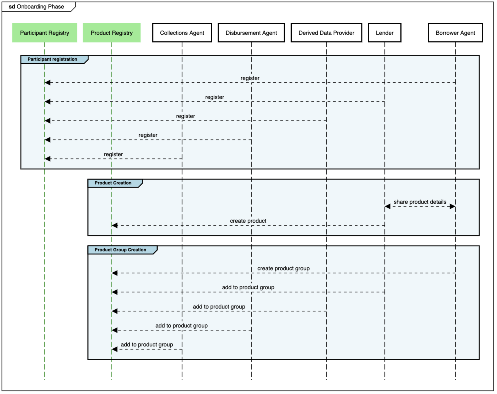
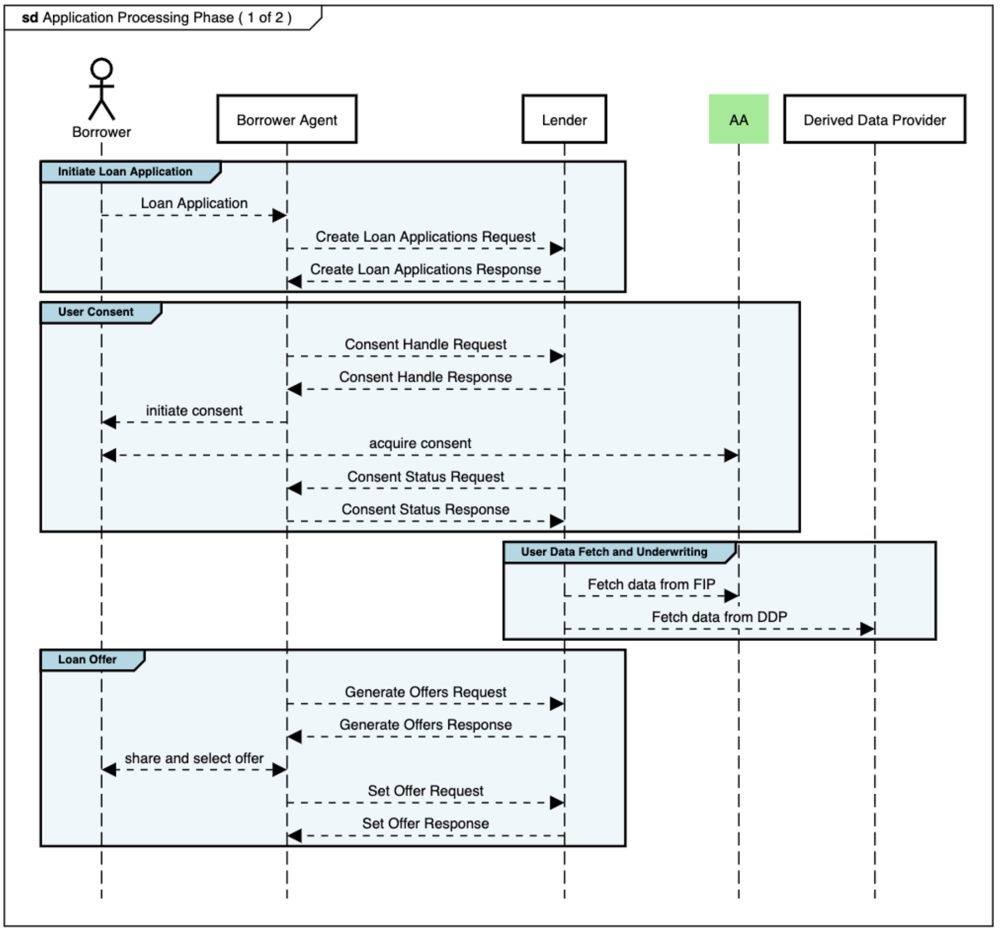
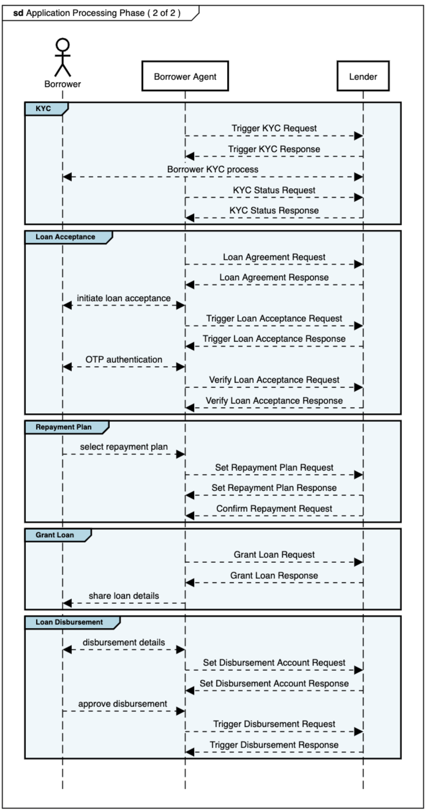
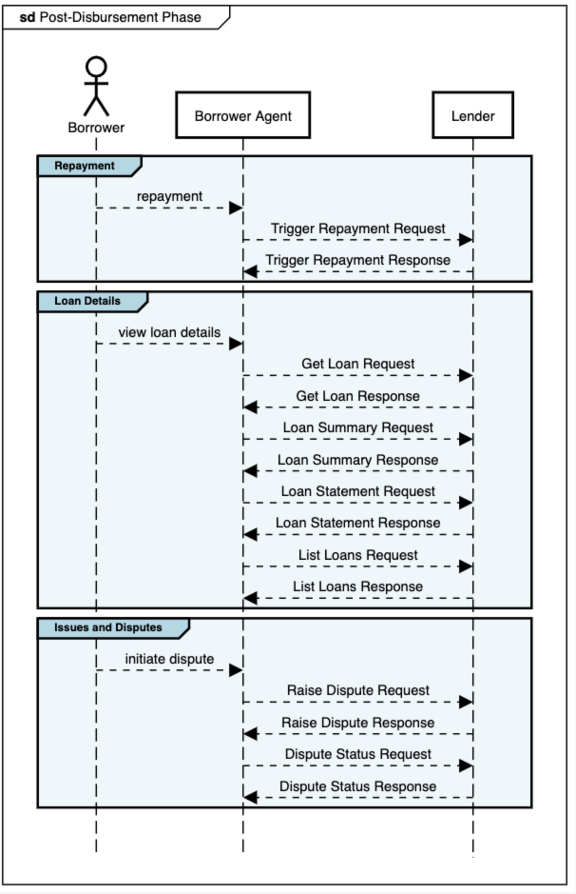

# Participant Overview

The following is a high-level sequence diagram of the end-to-end lending journey, split into the three phases - Onboarding, Application Processing and Post-Disbursement.

## Onboarding

## Application Processing

## Post-Disbursement

