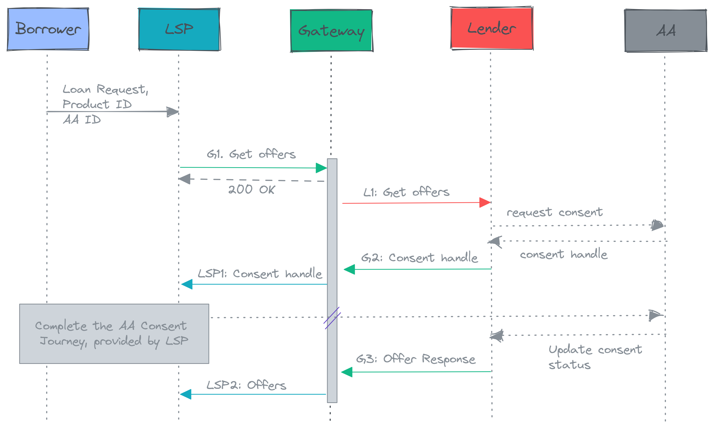

# Introduction

OCEN 4.0: Open Credit Enablement Network specification APIs

India is starved of access to formal, affordable credit. There is a massive market opportunity to be tapped here that has been inhibited because the current rails for flow of capital to the untapped market are broken.

They are broken for the lenders, to be able to reach out to these prospective borrowers and surface creditworthy borrowers. Few of the many reasons include high cost of borrower acquisition and time consuming custom third party tie-ups with loan originators.

They are broken for the marketplaces to connect their customers with lenders. The custom integrations and manual processes are costly and time consuming. The Turnaround Time to get loans deposited to customers is high and their ability to provide custom financial products quickly is restricted, owing to implementation challenges.

Sourcing, identity verification, underwriting, disbursement, recollections and dispute management are few of the many responsibilities managed by a lender today. Historically, the best lenders have had to excel at each of these skills in order to maximize their profit pools and serve the larger and larger markets.

OCEN is an initiative to unbundle lending and enable the creation of specialized entities, each specialized at one part of the job. Therefore, we envision the future of lending to be a partnership between multiple firms individually focused on sourcing/distribution, identity verification, underwriting, capital arrangement, recollections, etc. The entities like marketplaces who have high business-connect with their customers (businesses or individuals), can embed credit offerings in their applications now. These entities are referred to as ‘Borrower Agents’ (BAs) and were previously referred to as  'Loan Service Providers' (LSPs).

BA is a departure from the Direct Sourcing Agent (DSA) model and is an 'agent of the borrower'. BA explains to borrowers their 'bill of rights' ensuring transparency and safeguarding of borrower interests. It educates them about the various credit product offerings, pricing and more details. It helps them get access to formal, affordable credit at low interest rates and collaborates with lenders to create more tailored offerings for borrowers.

A reference pilot was created to showcase the power of the above idea in the GST SAHAY pilot project that used the OCEN 3.3 APIs. In its simplest form, it's a loan marketplace that enables SMEs to compare loan offers from multiple lenders and choose the best one. In its more advanced version, this BA would be akin to a borrower’s financial advisor, looking after their interests, fetching the best offers and advising the customer to make good decisions.

In the longer run, it is envisioned that many more BAs (with apps) will be created. Each of these would focus on distinct borrower pools and build the specialized experiences suited to their customers. This would allow lenders to focus purely on their underwriting and collections logic and cater to diverse collaborations with the BAs.

This is a manifestation of our efforts to democratise credit.

# Terminology

Following is the list of all abbreviations used in the document

| Acronym | Expansion |
| --- | --- |
| AA | Account Aggregator |
| BA | Borrower Agent |
| LSP | Loan Service Provider (see BA) |
| OCEN | Open Credit Enablement Network |

# Changes in Version 4.0

This is version 4.0 of the OCEN Specification. This is an update to the earlier OCEN APIs Specification v3.3 used by the GST SAHAY pilot.

OCEN v3.3 API Specification is implemented by the LSP and the Lender entities. The entities directly communicate with each other as there is only one LSP in the architecture.  

The new OCEN 4.0 version enables multiple participants in the ecosystem across various roles.  Additionally, apart from the API specification, this version also includes 3 new components (Auth service, Product registry and Participant Registry) that enable the coordination between the multiple participants in the system. 

# Participant Roles 

OCEN 4.0 supports the following different roles for participants:
- Lender - Creates and owns the product 
- Borrower Agent (BA) - Creates a Product Group - the network of participants needed to fulfil all the needs to the product such as collections partner, disbursement partner, etc and serves as the agent of the borrower by surfacing the offers and enabling the loan application process  
- Derived Data Provider (DDP) - Enables better underwriting for the lender by providing additional data about the borrower or about the market of the product 
- Disbursement Agent (DA) - Enables disbursement of the loan
- Collections Agent (CA) - Enables monitoring and collections post disbursement

# OCEN 4.0 Components

Apart from the API specification for the participants to communicate with each other, OCEN 4.0 includes 3 components that enable coordination between the different participants in the system - 
- Auth Service
- Product registry and 
- Participant Registry 

## Auth Service
The Auth service addresses two main concerns in the ecosystem:

1. Identity of the entity accessing an endpoint
2. Integrity and non-repudiation so entities cannot deny their actions after performing any operation

The Auth service enables both concerns by providing API access keys for authentication of every request as well as signing every request/response with the security certificates.

## Product Registry

Web portal where Lenders in the OCEN ecosystem register their products. Once a product is created, participants such as BAs registered in the Participant registry will be able to view and subscribe to these products. The Product Registry allows BAs and other participants to easily discover new products for their borrowers from different lenders. The Product Registry also enables Lenders to reach new borrowers via the BAs that subscribe to the products. 

## Participant Registry

Web portal where all the participants in the OCEN ecosystem register themselves. Post approval, participants will be able to fetch access keys to use in making the API calls. 

# High Level Architecture
The following is a high-level sequence diagram of the OCEN 4.0 flow for the initial phases from Product creation through loan granting that highlights the role of the above components. The end-to-end flow can be split into 3 phases:
1. Onboarding
2. Loan Application and Processing
3. Post-Disbursement

> To be updated

# Participant Overview
Below are the technical requirements and the end-to-end flow from the perspective of each participant in the ecosystem.

## Lender Overview
Below is the overview of the end-to-end flow from the perspective of a Lender.

### Onboarding Phase
Lenders first need to be onboarded onto the Participant Registry with their basic data. Once approved, they can use the API access key from the Participant Registry portal for making the API calls.

Lenders will then create the product in the Product Registry portal with all necessary attributes such as:
- Product category
- Borrower types
- Data requirements
- Loan workflow configurations - Collections, Disbursement, etc.
 
Once a product has been created and added to the portal, all participants will be able to discover the product. Participants can then subscribe to any of the existing products that need their role as part of the product’s loan workflow.

The Lender will serve as the OWNER of the product and is the only participant who can change the product attributes subsequently.

Post product-creation, Lenders get added to Product Groups by Borrower Agents to serve borrowers in their network. They then start receiving Loan Application requests.

*There are no API calls and implementation in this phase.*

### Loan Application and Processing Phase
Lenders receive Loan Application requests from the Borrower Agent, request Consent from the borrower and initiate the loan Offer. Upon acceptance of the Offer, the Lender performs the borrower KYC, confirms the loan disbursement and repayment terms with the borrower and then grants the loan. 

The handshake and the steps in this phase follow the APIs defined in the APIs list. 

### Post-Disbursement Phase
Post-disbursement of the loan, any disputes from the borrower are handled by the Lender via the Loan Dispute APIs in the APIs list.

### Metadata APIs
In addition to the above, the Lender will maintain a Heartbeat API (see APIs list) to indicate the health status of their systems to the rest of the network.

## BA Overview
Below is the overview of the end-to-end flow from the perspective of a Borrower Agent participant across the 3 phases of the OCEN 4.0 flow.

### Onboarding Phase
BAs first need to be onboarded onto the Participant Registry with their basic data. Once approved, they can use the API access key from the Participant Registry portal for making the API calls.

Borrower Agents in the ecosystem will then be able to drive the product life cycle by inviting other necessary participants needed in the product’s loan workflow. Once registered in the portal, BAs can create a Product Group and invite other participants (Collections, Disbursement partners and Derived Data Providers) for a particular product.

BAs also need to select an SRO who will manage any dispute resolution issues for them and will serve as the guardrails against bad actors in the ecosystem.

There are no API calls and implementation in this phase.

### Loan Application and Processing Phase
BAs forward the Loan Application requests to the Lender. They then drive the Loan Application process with the lender by enabling the Lender to get Consent from the borrower and then to provide the loan Offer. Upon acceptance of the Offer by the borrower, the BA enables the Lender to perform the borrower KYC, confirm the loan disbursement and repayment terms with the borrower and then to grant the loan. 

The handshake and the steps in this phase follow the APIs defined in the APIs list. 

### Post-Disbursement Phase
Post-disbursement of the loan, any disputes from the borrower are forwarded to the Lender by the BA via the Loan Dispute APIs (see APIs list).

### Metadata APIs
In addition to the above, the BA will maintain a Heartbeat API (see APIs list) to indicate the health status of their systems to the rest of the network.

# API Design Principles

## Async design
By design, all APIs are designed to enable end-to-end flows asynchronously. All requests use the requestId field for the purposes for mapping responses to their respective requests. And each request generates a standard acknowledgement from the other end while the callee (typically Lender) processes the request. API callers (typically BA) can poll for the status of the operation using a webhook. Thus each operation will have two separate APIs - one from the caller to submit the request and another async response back from the callee when the operation has completed. 

For example: Create Loan Application operation has the following 2 APIs:
- CreateLoanApplicationRequest -> Request sent by BA to the Lender
- CreateLoanApplicationResponse -> Async Response sent by Lender to BA

## Idempotency
All request calls should be idempotent on the requestId field i.e. two calls to CreateLoanApplication with the same requestId shouldn’t result in two applications to be created. Callees are expected to return the same response as sent earlier for a duplicate request.

## Complete Request Objects 
All API calls and interactions are designed to include complete request objects instead of just the object identifiers in the request / responses. This design is to enable caller and callee to be able to process the request without needing to look up the attributes and other details.

## Security

> To be updated

All participants must follow the security requirements while transmitting data over API calls. On a high level, these are the security aspects that need to be ensured.

1. HTTPS - All API calls must be done securely over HTTPS
2. Two-way TLS -  The system should use Two-way TLS to ensure that both parties can send the information securely
3. Digital Signature - All communication between the participants should be digitally signed as per the JSON Web Signature Specification
4. Post participant registration with the Participant Registry, the private / public keys for authentication will be available in the portal

### What is two-way TLS/SSL
The credit system that we are building is an asynchronous system and we need to ensure that both systems follow Transport Layer Security (TLS) Protocol to communicate with each other. In Normal TLS, the client first checks the authenticity of the server. However, the server does not try to identify the client. Since, in our case, we need to verify the identities of both the systems involved, “Two Way SSL” needs to be used. "Two-Way SSL" is usually called TLS/SSL with client certificate authentication because both parties authenticate each other.

# API List

Following is the list of all APIs part of the OCEN 4.0 specification.

## Loan Application APIs
| API Name | Caller | Callee | Description |
| ---- | ---- | ---- | ---- | 
| Create Loan Applications Request | BA | Lender | Create Loan applications endpoint available on Lender to be used by BA | 
| Create Loan Applications Response | Lender | BA | This is the response for Create Loan Applications but invoked by the lender. No offers are rolled out as part of this API. If the lender system finds preliminary information sufficient for doing the loan processing, it will send “PROCESSING” as the status. Otherwise, it can reject the application citing a reason for the same. | 

## Consent APIs
| API Name | Caller | Callee | Description | 
| ---- | ---- | ---- | ---- | 
| Consent Handle Request | BA | Lender | Create consent handle with Account Aggregator. This API is used to request the lenders to send a consent request for fetching the bank account statements, GST historical data. The lender (FIU) checks with the AA and creates a consent handle internally once this API is triggered | 
| Consent Handle Response | Lender | BA | Invoked by lender to send consent handle created in Account Aggregator. | 
| Consent State Update Request | BA | Lender | Invoked by BA to inform Lenders of the consent journey state once the customer has interacted with Account Aggregator | 
| Consent Status Request | Lender | BA | Invoked by Lender to get consent handle status from BA | 
| Consent Status Response | BA | Lender | Invoked by BA to send consent status to Lender | 

## Offers APIs
| API Name | Caller | Callee | Description | 
| ---- | ---- | ---- | ---- | 
|Generate Offers Request | BA | Lender | The BA sends this request to the lender to get the list of offers that the lender is willing to provide for the loan applications already shared. | 
| Generate Offers Response | Lender | BA | This API is invoked by the lender informing the borrower regarding the various loan offers that have been generated corresponding to each of the loan applications. This is a bulk API, where multiple loan offers can be sent to the borrower in one shot. | 
| Set Offer Request | BA | Lender | This API is invoked by the BA to inform the lender about the offer that the borrower has chosen for a particular loan application. | 
| Set Offer Response | Lender | BA | This API is invoked by the lender and is the asynchronous response to Set Offer Request API. | 

## KYC APIs
| API Name | Caller | Callee | Description | 
| ---- | ---- | ---- | ---- | 
| Trigger KYC Request | BA | Lender | Request by BA to initiate the KYC process of the borrower after successfully accepting the final offer. (OKYC if applicable and Udyam) | 
| Trigger KYC Response | Lender | BA | Response sent by Lender with the url for KYC details submission.  | 
| KYC Status Request | BA | Lender | Request sent by BA to get the KYC status. This API will be triggered just after the user completes the KYC process. The lender is supposed to provide a reference number in the first call. This method can be called later to know the status of KYC. | 
| KYC Status Response | Lender | BA | This API is called by the lender to inform the status of the KYC process. Lender is also supposed to inform the BA about the action required for | completing the KYC. | 

## Loan Acceptance APIs
| API Name | Caller | Callee | Description | 
| ---- | ---- | ---- | ---- | 
| Loan Agreement Request | BA | Lender | Request sent by BA to lender to initiate the loan acceptance steps beginning with asking for the loan agreement |
| Loan Agreement Response | Lender | BA | Response given by the lender with the loan agreement for the borrower | 
| Trigger Loan Acceptance Request | BA | Lender | Request sent by BA to lender to send an OTP to phone number associated with verified by individual KYC | 
| Trigger Loan Acceptance Response | Lender | BA | Response given by the lender for TriggerOTPRequest | 
| Verify Loan Acceptance Request | BA | Lender | This API is invoked by the BA when the user enters the OTP received on the mobile number and agrees to the terms of the agreement. The asynchronous response for this API should include the lender acknowledging the receipt of OTP and verifying if the user has entered the correct OTP that was shared by the lender. | 
| Verify Loan Acceptance Response | Lender | BA | This API is invoked by the Lender  when the OTP entered by the user is shared through the BA. This API acknowledges the receipt of OTP and verifies if the user has entered the correct OTP that was shared by the lender on the mobile number associated with the disbursement account. | 

## Repayment Plan APIs
| API Name | Caller | Callee | Description | 
| ---- | ---- | ---- | ---- | 
| Set Repayment Plan Request | BA | Lender | This API is invoked by the BA to inform the lender system about the details of the repayment plan that will be used by the borrower. | 
| Set Repayment Plan Response | Lender | BA | This API is invoked by the lender to the BA giving the payment url where he can enter details of repayment. | 
| Set Repayment Plan Status Request | BA | Lender | This API is used by BA to check the status of a previously initiated set repayment plan request. This API is called once the payment page of the lender is loaded and the borrower choses a repayment method associated with the chosen repayment plan. | 
| Set Repayment Plan Status Response | Lender | BA | This API is used by lenders to inform BA about the status of a previously initiated set Repayment.The API returns the status of the repayment plan that the borrower has chosen. In case, the borrower has chosen e-mandate as the repayment method in payment page url, the status of the repayment plan becomes ACTIVE only after successful authorization of the e-mandate on the PSP by the borrower. | 
| Confirm Repayment Request | Lender | BA | This API is used by lenders to inform BA about the status of a repayment handled directly by the lender (Triggered on Lender side - Payment on the branch or auto E-Mandate repayment). |

## Grant Loan APIs
| API Name | Caller | Callee | Description | 
| ---- | ---- | ---- | ---- | 
| Grant Loan Request | BA | Lender | This API is invoked by the BA once the borrower completes successful signing of the loan agreement to create the actual loan in the lender’s system. | 
| Grant Loan Response | Lender | BA | This method is called be the Lender when the Grant Loan processing is completed. This informs the borrower about the status of the loan in the lender system. Upon successful creation of a loan in the system, the lender returns all the details of the loan. | 

## Disbursement APIs
| API Name | Caller | Callee | Description | 
| ---- | ---- | ---- | ---- | 
| Set Disbursement Account Request | BA | Lender | This API is invoked by the BA to inform the lender about the disbursement account that the borrower has chosen. | 
| Set Disbursement Account Response | Lender | BA | This API is invoked by the lender to inform the BA regarding whether the lender has successfully set the disbursement account which was sent in SetDisbursementAccountRequest. |
| Trigger Disbursement Request | BA | Lender | This API is to be used when the borrower wants the money to be disbursed immediately. |
| Trigger Disbursement Response | Lender | BA | Response given by the lender for TriggerDisbursement |
| Trigger Disbursement Status Request | BA | Lender | This API is to be used by BA to check the status of a previously initiated disbursement request. |
| Trigger Disbursement Status Response | Lender | BA | Response given by lender for  a trigger Disbursement Status Request. |

## Trigger Repayment APIs
| API Name | Caller | Callee | Description | 
| ---- | ---- | ---- | ---- | 
| Trigger Repayment Request | BA | Lender | This API is invoked by the BA to inform the lender to trigger a repayment. This API will not be called when payment is routed to lender via collection agent. | 
| Trigger Repayment Response | Lender | BA | This API is invoked by the lender to the BA giving the lender payment page url from where the borrower can make the payment. Lender also generates an id for the payment which becomes the reference for BA to check the status of repayment. | 
| Trigger Repayment Status Request | BA | Lender | This API is used by BA to check the status of a previously initiated repayment transaction. In the case where collection is handled by Collection Management System (CMS), once the BA receives payment confirmation (including transaction reference number) from the Collection Management System, BA will send a request to the lender to check if a payment has been credited against the transaction Reference Number. | 
| Trigger Repayment Status Response | Lender | BA | This API is used by BA to check the status of a previously initiated repayment transaction. In the case where collection is handled by Collection Management System (CMS), once the BA receives payment confirmation (including transaction reference number) from the Collection Management System, BA will send a request to the lender to check if a payment has been credited against the transaction Reference Number. | 

## Loan Details APIs
| API Name | Caller | Callee | Description | 
| ---- | ---- | ---- | ---- | 
| Get Loan Request | BA | Lender | This API is invoked by the BA when the BA wants to get the details of the loan. | 
| Get Loan Response | Lender | BA | This method is called by the Lender and it returns all the details of the loan. | 
| Loan Summary Request | BA | Lender | Request raised by the BA to get the current summary of the loan | 
| Loan Summary Response | Lender | BA | Response given by lender for LoanSummary Request | 
| Loan Statement Request | BA | Lender | Request raised for getting the current loan account statement | 
| Loan Statement Response | Lender | BA | Response giving the Loan account statement | 
| List Loans Request | BA | Lender | This API is invoked by BA to get the list of loans given by lender for a borrower | 
| List Loans Response | Lender | BA | This API gives get the list of loans given by lender for a borrower | 

## Dispute APIs
| API Name | Caller | Callee | Description | 
| ---- | ---- | ---- | ---- | 
| Raise Dispute Request | BA | Lender | Request raised by BA to create a dispute in lender system |
| Raise Dispute Response | Lender | BA | Response given to BA by lender post RaiseDisputeRequest |
| Dispute Status Request | BA | Lender | This API is invoked by the BA to get the status of a dispute |
| Dispute Status Response | Lender | BA | This API is invoked by the Lender to send the status of a dispute |

## Analytics APIs
| API Name | Caller | Callee | Description | 
| ---- | ---- | ---- | ---- | 
| Analytics Heartbeat Push Request | All | OCEN 4.0 Auth Service | This API is used by participants to indicate healthy status of their service. |
| Analytics Metrics Push Request | All | OCEN 4.0 Auth Service | This API is used by participants to send metrics for analytics. |

## Derived Data Provider APIs
| API Name | Caller | Callee | Description | 
| ---- | ---- | ---- | ---- | 
| Register Derived Data Provider Schema | Derived Data Provider | Product Registry | This API is used by the Dervied Data Provider to register the schema with the Product Registry. Once registered, Lenders will be able to lookup the schema from the Product Regitsry and fetch data from the Derived Data Provider to underwrite the loan. |
| Get Schema by Derived Data Provider ID | Lender | Product Registry | This API is used by the Lender to lookup all schemas supported by a data provider. |
| Get Schema by Schema ID | Lender | Product Registry | This API is used by the Lender to lookup schema supported by a data provider using the schema ID. |
| Delete Schema by Schema ID | Derived Data Provider | Product Registry | This API is used by the Derived Data Provider to delete a registered schema from the Product Registr12y. |

# API Details
